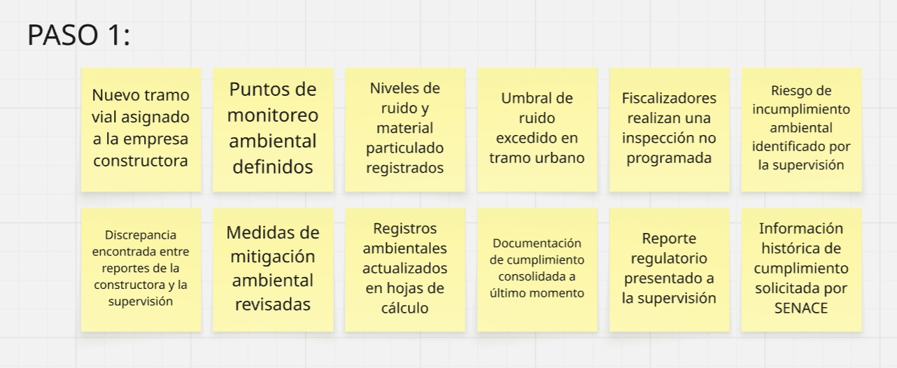
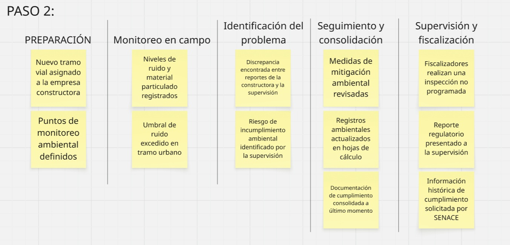

# Requirements Elicitation & Analysis

## 2.1 Competidores

### 2.1.1 Análisis Competitivo

| **¿Por qué llevar a cabo este análisis?** | El objetivo de este análisis competitivo es identificar las principales características, fortalezas, debilidades y enfoques de soluciones existentes relacionadas con el monitoreo ambiental y la gestión de proyectos de construcción. El contraste entre RoadWatch OS, SiteHive, Sonitus Systems y Autodesk Construction Cloud permite identificar oportunidades de diferenciación para la propuesta de VíaNexo, especialmente en la centralización de información ambiental, seguimiento de incidencias, trazabilidad de evidencias y apoyo a la gestión preventiva en proyectos viales. |
| :--- | :--- |

| **Categoría** | **RoadWatch OS (VíaNexo)** | **SiteHive** | **Sonitus Systems** | **Autodesk Construction Cloud** |
| :--- | :---: | :---: | :---: | :---: |
| **Cabecera** |  |  |  |  |
| **Perfil** | | | | |
| **Overview** | Plataforma HaaS/SaaS orientada al monitoreo ambiental y la gestión preventiva en proyectos viales mediante integración de mediciones, incidencias, acciones de mitigación y evidencias. | Plataforma SaaS australiana especializada en monitoreo ambiental continuo de ruido, polvo y vibración para construcción y minería. | Proveedor global especializado en instrumentación y monitoreo ambiental mediante dispositivos para ruido y calidad del aire integrados con servicios en la nube. | Suite integral basada en la nube para la gestión de proyectos de construcción, coordinación BIM, control documental y seguimiento de incidencias. |
| **Ventaja competitiva (valor al cliente)** | Integración del monitoreo ambiental con la gestión de incidencias, acciones de mitigación y evidencias dentro de una misma plataforma orientada específicamente a proyectos viales. La propuesta busca facilitar una gestión preventiva y mantener la trazabilidad de la información necesaria para supervisiones y auditorías. | Automatización del procesamiento de datos ambientales de campo y capacidades especializadas para monitoreo continuo en proyectos de construcción. | Especialización en equipos de medición ambiental y monitoreo remoto mediante instrumentación orientada al control de ruido y calidad ambiental. | Integración con herramientas de diseño y construcción del ecosistema Autodesk, permitiendo centralizar documentación, coordinación y seguimiento de proyectos. |
| **Perfil de Marketing** | | | | |
| **Mercado objetivo** | Empresas constructoras viales y empresas supervisoras o consultoras ambientales que gestionan uno o varios proyectos de infraestructura. | Empresas constructoras, contratistas y proyectos de infraestructura que requieren monitoreo ambiental continuo. | Consultoras ambientales, autoridades, empresas industriales y organizaciones que requieren monitoreo de ruido y calidad ambiental. | Empresas constructoras, consorcios de ingeniería, estudios de diseño y organizaciones responsables de gestionar proyectos de construcción. |
| **Estrategias de marketing** | Prospección B2B dirigida a empresas constructoras viales y consultoras ambientales, presencia en espacios especializados del sector y presentación de la propuesta mediante casos de uso relacionados con control ambiental y trazabilidad. | Marketing de contenidos, presentación de casos de uso en proyectos de construcción y promoción de capacidades de monitoreo ambiental continuo. | Venta consultiva especializada, presencia en mercados de instrumentación ambiental y comercialización mediante distribuidores y canales especializados. | Marketing B2B global, ecosistema de partners, certificaciones profesionales y promoción integrada dentro del ecosistema Autodesk. |
| **Perfil de Producto** | | | | |
| **Productos & Servicios** | Plataforma web para gestión ambiental de proyectos viales, integración de mediciones, seguimiento de incidencias, acciones de mitigación, evidencias e información histórica asociada a proyectos y puntos de monitoreo. | Dispositivos de monitoreo ambiental y plataforma en la nube con visualización de datos, alertas y reportes. | Equipos de medición ambiental integrados con una plataforma web para consulta y análisis de información histórica. | Módulos de gestión de construcción, documentación, coordinación, incidencias, planos y colaboración entre participantes del proyecto. |
| **Precios & Costos** | Modelo de suscripción orientado a organizaciones, con posibilidad de estructurar planes según cantidad de proyectos, puntos de monitoreo y alcance de los servicios utilizados. | Modelo de contratación asociado al uso de dispositivos y servicios de monitoreo. | Comercialización de dispositivos de medición junto con servicios de acceso a plataforma y gestión de información. | Licenciamiento mediante suscripciones para usuarios y organizaciones, con diferentes planes según productos y capacidades contratadas. |
| **Canales de distribución** | Plataforma web responsiva accesible mediante navegador, complementada con servicios asociados al monitoreo de proyectos viales. | Plataforma web y servicios asociados al despliegue de dispositivos de monitoreo. | Plataforma web y distribución de equipos especializados mediante canales comerciales y representantes. | Plataforma web, aplicaciones móviles y herramientas integradas dentro del ecosistema Autodesk. |
| **Análisis SWOT** | *Las fortalezas permiten aprovechar oportunidades y sustentar la propuesta de diferenciación.* | | | |
| **Fortalezas** | Integración de monitoreo ambiental, seguimiento de incidencias y gestión de evidencias dentro de una plataforma orientada al contexto de proyectos viales, con una propuesta de servicio que busca reducir la necesidad de inversión inicial en infraestructura propia. | Especialización en monitoreo ambiental continuo y experiencia en proyectos de construcción e infraestructura. | Experiencia en instrumentación ambiental y disponibilidad de equipos especializados de monitoreo. | Amplio ecosistema de herramientas para proyectos de construcción y elevada integración entre sus productos. |
| **Debilidades** | Producto en etapa inicial de desarrollo, con menor presencia en el mercado y menor madurez tecnológica que competidores internacionales consolidados. El alcance inicial contempla un conjunto limitado de variables y funcionalidades de monitoreo ambiental. | Su enfoque se concentra principalmente en monitoreo ambiental y puede requerir soluciones adicionales para gestionar procesos operativos posteriores a una incidencia. | Su propuesta se centra principalmente en instrumentación y monitoreo, por lo que la gestión operativa de incidencias puede depender de herramientas complementarias. | Su alcance es general para gestión de construcción y no está específicamente orientado a procesos de supervisión ambiental vial. |
| **Oportunidades** | Mayor necesidad de digitalizar procesos de seguimiento ambiental, centralizar evidencias y mejorar la trazabilidad de información en proyectos de infraestructura vial. | Expansión de proyectos que requieren monitoreo ambiental continuo y mayor trazabilidad de información. | Crecimiento de la demanda de instrumentación ambiental conectada y monitoreo remoto. | Incorporación progresiva de capacidades adicionales mediante integraciones y extensiones del ecosistema de construcción. |
| **Amenazas** | Presencia de proveedores internacionales consolidados, incorporación progresiva de funcionalidades ambientales en plataformas generales de construcción y posibilidad de que las empresas clientes mantengan procesos manuales existentes debido a costos o complejidad de adopción. | Entrada de nuevos proveedores especializados y plataformas con capacidades similares de monitoreo ambiental. | Competencia de fabricantes de equipos de menor costo y nuevas soluciones de monitoreo conectado. | Aparición de plataformas especializadas que resuelvan necesidades específicas de industrias o dominios que una solución generalista no cubre en profundidad. |

#### Síntesis del análisis competitivo

El análisis evidencia que las soluciones evaluadas cubren diferentes partes del problema. SiteHive y Sonitus Systems presentan capacidades especializadas de monitoreo ambiental mediante dispositivos y plataformas digitales, mientras que Autodesk Construction Cloud ofrece un entorno más amplio para la gestión de proyectos de construcción.

La oportunidad identificada para RoadWatch OS se encuentra en combinar el seguimiento de variables ambientales con la gestión operativa de incidencias, acciones de mitigación, responsables y evidencias dentro de un entorno orientado al contexto de proyectos viales.

Esta diferenciación no se plantea únicamente desde la captura de datos, sino desde la posibilidad de relacionar la información ambiental con las acciones posteriores que realizan las empresas constructoras y las empresas supervisoras o consultoras ambientales.

### 2.1.2. Estrategias y tácticas frente a competidores

A partir del análisis competitivo realizado, VíaNexo identifica oportunidades para diferenciar RoadWatch OS frente a plataformas especializadas en monitoreo ambiental, proveedores de instrumentación y suites generales de gestión de proyectos de construcción.

Las estrategias y tácticas propuestas buscan aprovechar las fortalezas identificadas en el análisis SWOT y responder a las principales brechas observadas en las alternativas evaluadas.

#### Estrategia 1: Integración del monitoreo ambiental y la gestión operativa

Mientras algunas soluciones se concentran principalmente en la captura o visualización de mediciones ambientales, RoadWatch OS plantea integrar en un mismo entorno el monitoreo, la identificación de incidencias, la asignación de acciones de mitigación, el seguimiento de responsables y el almacenamiento de evidencias.

**Tácticas:**

- Centralizar las mediciones ambientales de los diferentes frentes de obra.
- Relacionar las alertas e incidencias con responsables, acciones correctivas y evidencias.
- Mantener un historial de los eventos ambientales ocurridos en cada proyecto o tramo.
- Facilitar el seguimiento de las acciones de mitigación desde su identificación hasta su cierre.

#### Estrategia 2: Orientación preventiva frente al cumplimiento ambiental

RoadWatch OS busca diferenciarse de los procesos de supervisión principalmente reactivos mediante la identificación oportuna de situaciones que puedan aproximarse a los límites ambientales establecidos.

**Tácticas:**

- Incorporar alertas asociadas a los valores registrados en los puntos de monitoreo.
- Facilitar la visualización de tendencias e información histórica.
- Permitir que los responsables identifiquen rápidamente proyectos o frentes que requieren atención.
- Apoyar la toma de decisiones antes de que una situación derive en una observación o posible incumplimiento.

#### Estrategia 3: Centralización y trazabilidad de la evidencia ambiental

Frente al uso fragmentado de hojas de cálculo, correos electrónicos, documentos y aplicaciones de mensajería, RoadWatch OS plantea mantener la información ambiental relacionada dentro de una única plataforma.

**Tácticas:**

- Asociar mediciones, fotografías, incidencias y acciones correctivas al proyecto y punto de monitoreo correspondiente.
- Mantener registros históricos que permitan reconstruir los eventos ocurridos.
- Facilitar la consulta de información necesaria para supervisiones, auditorías y fiscalizaciones.
- Reducir el esfuerzo requerido para localizar y consolidar evidencias provenientes de diferentes fuentes.

#### Estrategia 4: Modelo de servicio accesible para empresas del sector vial

RoadWatch OS plantea un modelo de servicio que permita a las organizaciones acceder a capacidades de monitoreo ambiental sin depender necesariamente de grandes inversiones iniciales en infraestructura tecnológica propia.

**Tácticas:**

- Ofrecer planes de servicio adaptados a la cantidad de proyectos, frentes de obra o puntos de monitoreo.
- Integrar dentro de la propuesta el uso de dispositivos de monitoreo y la plataforma digital.
- Orientar la oferta comercial a empresas constructoras viales y empresas supervisoras o consultoras ambientales.
- Facilitar una adopción progresiva de la plataforma de acuerdo con las necesidades de cada organización.

#### Estrategia 5: Especialización en procesos de gestión ambiental de proyectos viales

A diferencia de plataformas generales de gestión de construcción, RoadWatch OS se orienta específicamente a las actividades de monitoreo, seguimiento y supervisión ambiental asociadas a proyectos de infraestructura vial.

**Tácticas:**

- Utilizar conceptos y flujos propios del dominio de gestión ambiental vial.
- Organizar la información por proyecto, tramo, frente de obra y punto de monitoreo.
- Priorizar funcionalidades vinculadas con mediciones ambientales, incidencias, acciones de mitigación y evidencias.
- Diseñar la experiencia considerando las necesidades diferenciadas de empresas constructoras y empresas supervisoras o consultoras ambientales.

## 2.2 Entrevistas

### 2.2.1 Diseño de Entrevistas

#### Preguntas presentación

- ¿Hola cuál es tu nombre y edad?
- ¿Cuál es tu cargo actual y hace cuánto tiempo te desempeñas en él?
- ¿Cuáles son tus principales responsabilidades del día a día en relación con la gestión o supervisión ambiental del proyecto?

### Segmento 1: Líderes o jefes de gestión de proyectos viales (Empresas Constructoras)

#### Preguntas principales:

1. Buen día, ¿podría comentarme su nombre, edad y el puesto que desempeña dentro de la constructora?

2. ¿Cuántos frentes de obra o tramos viales tienen actualmente en ejecución bajo su cargo?

3. ¿Cómo realizan actualmente el registro y seguimiento de los indicadores ambientales (aire, ruido, agua) en los frentes de trabajo?

4. ¿Qué herramientas utilizan el equipo de campo y la oficina central para compartir las mediciones, fotografías de evidencias y reportes ambientales?

5. Al ejecutar y gestionar varios frentes/tramos viales simultáneamente, ¿qué tan complicado resulta mantener organizada y al día toda la documentación e historial ambiental?

6. ¿Qué ocurre o qué protocolo siguen cuando en campo detectan que un indicador (como polvo o ruido) está cerca de superar o ya superó el límite del ECA/LMP?

7. Tras detectar una incidencia o recibir una observación de la supervisión, ¿cómo asignan y hacen el seguimiento a las acciones de mitigación en campo?

8. ¿Qué dificultades enfrentan al momento de consolidar la información para responder a las auditorías de la supervisión o ante entidades fiscalizadoras (ej. OEFA / MTC)?

9. ¿Cuál considera que es la principal dificultad que enfrentan como constructora al gestionar la parte ambiental en múltiples tramos a la vez?

10. Si pudiera cambiar una sola cosa del proceso con el que gestionan las contingencias ambientales en obra, ¿qué cambiaría?

11. ¿Considera útil contar con alertas telemáticas o sensores que les avisen automáticamente antes de sobrepasar los límites normativos?

12. Finalmente, ¿qué información o indicador considera crítico tener a la mano para garantizar que la obra no sea paralizada ni sancionada ambientalmente?

### Segmento 2: Empresas Supervisoras y Consultoras Ambientales (Múltiples Proyectos)

1. Buen día, ¿podría comentarme su nombre, edad y puesto que desempeña en el rubro de supervisión o consultoría ambiental?

2. En primer lugar, ¿cómo realizan actualmente el seguimiento de los indicadores ambientales de los proyectos que supervisan, como aire, ruido y agua?

3. ¿Qué herramientas utilizan para recibir y compartir las mediciones, fotografías y documentos de los diferentes proyectos?

4. Al supervisar varios proyectos, ¿qué tan complicado es mantener organizada toda la información ambiental?

5. ¿Qué ocurre cuando detectan una medición que podría representar un incumplimiento ambiental?

6. ¿Cómo realizan actualmente el seguimiento de las acciones correctivas después de detectar una incidencia?

7. ¿Qué dificultades encuentran al momento de preparar informes para una auditoría o fiscalización?

8. Entrevistador: ¿Cuál considera que es la principal dificultad al supervisar ambientalmente varios proyectos?

9. Entrevistador: Si pudiera cambiar una sola cosa del proceso actual, ¿qué cambiaría?

10. Entrevistador: ¿Considera útil recibir información ambiental directamente desde sensores instalados en los proyectos?

11. Entrevistador: Finalmente, ¿qué información considera más importante para supervisar correctamente el estado ambiental de los proyectos?

### 2.2.2 Registro de Entrevistas

Las entrevistas se realizaron a representantes de los dos segmentos objetivo definidos para RoadWatch OS. Para cada participante se registró información demográfica y profesional, evidencia audiovisual, duración de la entrevista y un resumen de los principales hallazgos obtenidos.

La información recopilada permitirá identificar características objetivas y subjetivas de cada segmento, incluyendo experiencia profesional, responsabilidades, herramientas utilizadas, dispositivos, canales digitales, objetivos, frustraciones, hábitos de trabajo y principales dificultades relacionadas con la gestión y supervisión ambiental.

### Segmento 1: Empresas Constructoras Viales

Los participantes de este segmento corresponden a profesionales involucrados en la gestión de proyectos viales y en actividades relacionadas con el seguimiento y cumplimiento ambiental de las obras.

#### Entrevista #1

| Campo | Información |
|---|---|
| Nombres | Pendiente |
| Apellidos | Pendiente |
| Edad | Pendiente |
| Distrito | Pendiente |
| Cargo | Pendiente |
| Años de experiencia | Pendiente |
| Evidencia | Pendiente |
| Enlace de video | Pendiente |
| Inicio de entrevista | Pendiente |
| Duración | Pendiente |
| Resumen | Pendiente de actualización con la nueva entrevista. |

#### Entrevista #2

| Campo | Información |
|---|---|
| Nombres | Pendiente |
| Apellidos | Pendiente |
| Edad | Pendiente |
| Distrito | Pendiente |
| Cargo | Pendiente |
| Años de experiencia | Pendiente |
| Evidencia | Pendiente |
| Enlace de video | Pendiente |
| Inicio de entrevista | Pendiente |
| Duración | Pendiente |
| Resumen | Pendiente de actualización con la nueva entrevista. |

#### Entrevista #3

| Campo | Información |
|---|---|
| Nombres | Pendiente |
| Apellidos | Pendiente |
| Edad | Pendiente |
| Distrito | Pendiente |
| Cargo | Pendiente |
| Años de experiencia | Pendiente |
| Evidencia | Pendiente |
| Enlace de video | Pendiente |
| Inicio de entrevista | Pendiente |
| Duración | Pendiente |
| Resumen | Pendiente de actualización con la nueva entrevista. |

### Segmento 2: Empresas Supervisoras y Consultoras Ambientales

Los participantes de este segmento corresponden a profesionales responsables de actividades de supervisión, consultoría, auditoría o seguimiento ambiental de uno o varios proyectos.

#### Entrevista #1

| Campo | Información |
|---|---|
| Nombres | Pendiente |
| Apellidos | Pendiente |
| Edad | Pendiente |
| Distrito | Pendiente |
| Cargo | Pendiente |
| Años de experiencia | Pendiente |
| Evidencia | Pendiente |
| Enlace de video | Pendiente |
| Inicio de entrevista | Pendiente |
| Duración | Pendiente |
| Resumen | Pendiente de actualización con la nueva entrevista. |

#### Entrevista #2

<table>
<thead>
  <tr>
    <th colspan="2">Entrevista #2</th>
  </tr>
</thead>
<tbody>
  <tr>
    <td>Nombre</td>
    <td>Guadalupe</td>
  </tr>
  <tr>
    <td>Apellidos</td>
    <td>Kim Chang</td>
  </tr>
  <tr>
    <td>Edad</td>
    <td>44</td>
  </tr>
  <tr>
    <td>Distrito</td>
    <td>San Isidro</td>
  </tr>
  <tr>
    <td>Evidencia</td>
    <td></td>
  </tr>
  <tr>
    <td>Link</td>
    <td><a href="https://upcedupe-my.sharepoint.com/:v:/g/personal/u202410421_upc_edu_pe/IQAzGWBr_180TaX5r2Ce2iHmAa0uzBUXWMWKYnJheWzFmdM?e=lzPTKe&nav=eyJyZWZlcnJhbEluZm8iOnsicmVmZXJyYWxBcHAiOiJTdHJlYW1XZWJBcHAiLCJyZWZlcnJhbFZpZXciOiJWaWV3IiwicmVmZXJyYWxBcHBQbGF0Zm9ybSI6IldlYiIsInJlZmVycmFsTW9kZSI6InZpZXcifX0%3D" target="_blank">Ver video</a></td>
  </tr>
  <tr>
    <td>Duración</td>
    <td>0:00 - 5:34</td>
  </tr>
  <tr>
    <td>Resumen</td>
    <td>Guadalupe desempeña funciones de supervisión y coordinación, realizando seguimiento a diferentes actividades y proyectos, revisando información, verificando el cumplimiento de procesos y coordinando con los responsables cuando se detectan observaciones o incidencias. Para el seguimiento ambiental utiliza principalmente reportes, hojas de cálculo, informes, correos electrónicos, carpetas compartidas y WhatsApp, lo que genera que la información se encuentre distribuida en diversos canales. Esta fragmentación dificulta localizar rápidamente mediciones, documentos, fotografías, incidencias y acciones correctivas, especialmente cuando se supervisan varios proyectos de manera simultánea. Además, señala que el seguimiento suele ser reactivo debido a que las mediciones no siempre están disponibles de forma inmediata y que el control de incidencias abiertas y acciones pendientes requiere una revisión manual. Guadalupe considera que una plataforma centralizada con alertas preventivas permitiría mejorar significativamente este proceso, especialmente si incorpora estados visuales como verde, amarillo y rojo para identificar rápidamente situaciones normales, de atención o críticas. Asimismo, considera útil integrar sensores para obtener información continua y facilitar la supervisión remota, sin reemplazar completamente las visitas presenciales. Destaca también la importancia de conservar un historial completo de mediciones, incidencias, responsables, acciones correctivas y evidencias para auditorías o fiscalizaciones. Finalmente, considera que una solución ideal debería ofrecer una vista general de todos los proyectos, visualización geográfica mediante mapas, alertas automáticas y generación de reportes descargables en PDF o Excel, reduciendo así el trabajo manual y facilitando la toma de decisiones.</td>
  </tr>
</tbody>
</table>

#### Entrevista #3

| Campo | Información |
|---|---|
| Nombres | Pendiente |
| Apellidos | Pendiente |
| Edad | Pendiente |
| Distrito | Pendiente |
| Cargo | Pendiente |
| Años de experiencia | Pendiente |
| Evidencia | Pendiente |
| Enlace de video | Pendiente |
| Inicio de entrevista | Pendiente |
| Duración | Pendiente |
| Resumen | Pendiente de actualización con la nueva entrevista. |

### 2.2.3 Análisis de Entrevistas

**Segmento 1: Líderes o jefes de gestión de proyectos viales – Empresas Constructoras**

| Característica                                             | Mención |   %   | Evidencia                                                                                                                                                                                            |
| :--------------------------------------------------------- | :-----: | :---: | :--------------------------------------------------------------------------------------------------------------------------------------------------------------------------------------------------- |
| Uso de herramientas y canales fragmentados                 |   3/3   |  100% | Keler, Becker y Jaime utilizan Excel, WhatsApp, correos, carpetas compartidas, informes y otros medios separados para gestionar mediciones y evidencias ambientales.                                 |
| Dificultad para organizar información de múltiples frentes |   3/3   |  100% | Los entrevistados señalan que gestionar varios frentes simultáneamente dificulta mantener actualizados y correctamente asociados los documentos, mediciones, fotografías y evidencias.               |
| Necesidad de una plataforma centralizada                   |   3/3   |  100% | Los tres entrevistados consideran necesario disponer de una plataforma que concentre mediciones, incidencias, responsables, acciones y evidencias de todos los frentes de obra.                      |
| Interés en sensores y alertas preventivas                  |   3/3   |  100% | Keler, Becker y Jaime consideran beneficioso utilizar sensores IoT y alertas automáticas para detectar anticipadamente valores cercanos a los límites ambientales permitidos.                        |
| Seguimiento ambiental principalmente manual o reactivo     |   3/3   |  100% | Las mediciones y comunicaciones dependen actualmente de registros manuales, reportes periódicos o de que el personal detecte y comunique oportunamente una situación de riesgo.                      |
| Necesidad de visibilidad en tiempo real                    |   3/3   |  100% | Los entrevistados manifiestan la necesidad de conocer oportunamente lo que ocurre en cada tramo para evitar reaccionar cuando el incumplimiento o la observación ya se produjo.                      |
| Importancia de la trazabilidad de incidencias y evidencias |   3/3   |  100% | Se requiere mantener información asociada al tramo, fecha, punto de monitoreo, responsables, acciones ejecutadas y evidencias que permitan reconstruir el historial de una incidencia.               |
| Riesgo de sanciones, observaciones o paralizaciones        |   3/3   |  100% | Una preocupación recurrente es detectar los problemas ambientales antes de que generen observaciones de supervisión, multas, incumplimientos o paralizaciones de la obra.                            |
| Necesidad de gestionar acciones de mitigación              |   3/3   |  100% | Ante una incidencia se deben ejecutar acciones como riego de vías, control de velocidad, modificación de horarios u otras medidas, además de verificar posteriormente su cumplimiento.               |
| Dificultad para consolidar información para auditorías     |   2/3   | 66.7% | Keler y Becker destacan especialmente el tiempo invertido en localizar fotografías, mediciones y documentos dispersos para preparar expedientes solicitados durante supervisiones o fiscalizaciones. |

**Insights Destacados**

* La **fragmentación de la información** constituye uno de los principales problemas del segmento, ya que las mediciones, fotografías, documentos y comunicaciones se encuentran distribuidos entre Excel, WhatsApp, correos y carpetas compartidas.
* Existe una necesidad generalizada de pasar de una gestión ambiental **reactiva a una gestión preventiva**, detectando tendencias de riesgo antes de que un indicador supere los límites establecidos.
* El **100% de los entrevistados considera útil centralizar la información** de los diferentes frentes de obra en una única plataforma que permita visualizar indicadores, incidencias, responsables, acciones correctivas y evidencias.
* La incorporación de **sensores IoT y alertas automáticas** es percibida como una oportunidad para mejorar la capacidad de respuesta y reducir el riesgo de observaciones, multas o paralizaciones.
* La **trazabilidad histórica y documental** representa un aspecto crítico, especialmente para demostrar las acciones realizadas frente a una incidencia y responder de manera más eficiente ante auditorías o fiscalizaciones.

---

**Segmento 2: Empresas Supervisoras y Consultoras Ambientales – Múltiples Proyectos**

| Característica                                                        | Mención |   %   | Evidencia                                                                                                                                                                                       |
| :-------------------------------------------------------------------- | :-----: | :---: | :---------------------------------------------------------------------------------------------------------------------------------------------------------------------------------------------- |
| Uso de múltiples herramientas para gestionar información              |   3/3   |  100% | Angiela, Guadalupe y Guillermo utilizan principalmente Excel, correos electrónicos, WhatsApp, documentos PDF, carpetas compartidas y reportes para realizar el seguimiento ambiental.           |
| Dificultad para consolidar información de varios proyectos            |   3/3   |  100% | Los entrevistados indican que supervisar múltiples proyectos genera grandes cantidades de mediciones, fotografías, informes y observaciones distribuidas en distintos archivos y formatos.      |
| Necesidad de centralizar la información                               |   3/3   |  100% | Los tres participantes consideran que una plataforma centralizada permitiría revisar los diferentes proyectos sin depender de numerosos archivos, carpetas y canales de comunicación.           |
| Dificultad para obtener una visión global del estado de los proyectos |   3/3   |  100% | Actualmente resulta complicado identificar rápidamente qué proyecto presenta una incidencia, cuál posee acciones pendientes o cuál requiere mayor atención.                                     |
| Seguimiento manual de incidencias y acciones correctivas              |   3/3   |  100% | El seguimiento se realiza mediante matrices de Excel, correos, reuniones, reportes y revisión manual de evidencias entregadas por los responsables de cada proyecto.                            |
| Interés en sensores y monitoreo continuo                              |   3/3   |  100% | Los entrevistados consideran útil disponer de información obtenida mediante sensores para mejorar la supervisión y detectar con mayor rapidez cambios en los indicadores ambientales.           |
| Necesidad de alertas preventivas                                      |   2/3   | 66.7% | Angiela y Guadalupe destacan directamente la utilidad de contar con alertas que permitan identificar situaciones críticas o próximas a un incumplimiento antes de que el problema se agrave.    |
| Importancia del historial y trazabilidad                              |   3/3   |  100% | Se considera necesario disponer de registros históricos de mediciones, incidencias, responsables, acciones correctivas y evidencias para sustentar revisiones y fiscalizaciones.                |
| Dificultad para preparar auditorías e informes                        |   3/3   |  100% | La dispersión de mediciones, fotografías y documentos incrementa el tiempo requerido para consolidar información y elaborar expedientes o informes de cumplimiento.                             |
| Necesidad de geolocalización y ubicación de puntos de monitoreo       |   2/3   | 66.7% | Guadalupe destaca la visualización mediante mapas y Guillermo señala la importancia de conocer la ubicación exacta de cada punto de monitoreo para contextualizar correctamente las mediciones. |

**Insights Destacados**

* Las empresas supervisoras y consultoras enfrentan una fuerte **carga administrativa causada por la dispersión de información** proveniente de distintos proyectos, empresas y responsables.
* Existe una necesidad común de disponer de una **vista consolidada multiproyecto** que permita identificar rápidamente proyectos críticos, observaciones abiertas y acciones correctivas pendientes.
* El **100% de los entrevistados considera necesaria la centralización de mediciones, evidencias, incidencias e historial**, especialmente para reducir el tiempo dedicado a consolidar información manualmente.
* La incorporación de **sensores, alertas y visualización continua de indicadores** permitiría fortalecer la supervisión remota y detectar situaciones que requieren atención antes de convertirse en incumplimientos.
* La **trazabilidad y confiabilidad de los datos** son especialmente relevantes para este segmento, debido a que la información debe utilizarse posteriormente como sustento durante auditorías, fiscalizaciones y elaboración de informes oficiales.

---

## 2.3 Needfinding

### 2.3.1. User Personas

**Segmento 1**

Para el Segmento 1 (Empresas Constructoras Viales / Módulo Operativo) se elaboró el User Persona Carlos Mendoza. Se consideraron factores como su rol de Jefe de Proyectos Viales en una empresa constructora en Lima, su experiencia de más de 10 años liderando obras viales y su responsabilidad de coordinar múltiples frentes de trabajo asegurando el avance físico y el cumplimiento de las normativas ambientales aplicables. Sus principales objetivos se centran en mantener la continuidad de la obra sin paralizaciones, recibir alertas preventivas antes de exceder los límites permitidos de polvo o ruido y centralizar las evidencias fotográficas junto con los datos obtenidos en campo. Sus principales frustraciones se relacionan con la dispersión de información en herramientas como WhatsApp, Excel y correo, la falta de visibilidad sobre posibles eventos contaminantes lejanos, la respuesta tardía provocada por mediciones manuales y la pérdida de tiempo al preparar descargos para la supervisión. Asimismo, se tomó en cuenta su alto nivel de competencias en gestión del tiempo, organización, planificación y toma de decisiones, así como su necesidad de contar con una plataforma en la nube con telemetría IoT en tiempo real, notificaciones instantáneas ante riesgos de desviación y un sistema que permita realizar el seguimiento de las acciones correctivas. Todo ello orientado a reducir riesgos de multas o paralizaciones, optimizar el tiempo del equipo técnico y proteger la reputación de la empresa constructora.

**Segmento 2**

Para el Segmento 2 (Empresas Supervisoras Ambientales / Consultoras - Módulo de Fiscalización) se elaboró el User Persona Gisela Chavez. Se consideraron factores como su rol de Directora de Operaciones en una consultora ambiental, su vasta experiencia liderando auditorías y fiscalizaciones de proyectos de transporte a nivel nacional, y su necesidad de auditar el cumplimiento regulatorio de múltiples frentes de obra de forma transparente e imparcial. Sus principales frustraciones se relacionan con la falta de visibilidad centralizada por la dispersión de informes fragmentados provenientes de distintas constructoras, la pérdida de tiempo administrativo al navegar entre correos o reportes estáticos y la fricción que se genera al existir discrepancias de datos sobre posibles incumplimientos ambientales. Asimismo, se tomó en cuenta su alto nivel de competencias en gestión y planificación, y su necesidad de una plataforma SaaS que permita unificar los datos de cumplimiento en tiempo real, automatizar la generación de reportes oficiales respaldados por datos inalterables y priorizar la atención de auditorías mediante métricas claras de riesgo.

### 2.3.2. User Task Matrix

El User Task Matrix permite identificar y comparar las principales tareas que realizan los User Personas de los dos segmentos objetivo de RoadWatch OS para cumplir sus responsabilidades actuales.

Las tareas descritas corresponden a actividades que existen independientemente de la solución propuesta. Por lo tanto, no representan funcionalidades de RoadWatch OS, sino acciones propias del trabajo cotidiano de los usuarios dentro de los procesos de gestión y supervisión ambiental de proyectos viales.

Los User Personas considerados son:

- **Carlos Mendoza:** representante del Segmento 1, correspondiente a empresas constructoras viales.
- **Gisela Chavez:** representante del Segmento 2, correspondiente a empresas supervisoras y consultoras ambientales.

Para cada tarea se evalúa su frecuencia y nivel de importancia dentro de las actividades de cada User Persona.

| Task | Carlos Mendoza - Frequency | Carlos Mendoza - Importance | Gisela Chavez - Frequency | Gisela Chavez - Importance |
|---|---|---|---|---|
| Revisar el estado ambiental de los proyectos o frentes de obra | Daily | Critical | Daily | Critical |
| Revisar mediciones ambientales registradas en campo | Daily | Critical | Weekly | High |
| Coordinar con responsables ambientales y personal de campo | Daily | High | Daily | High |
| Verificar el cumplimiento de compromisos y requisitos ambientales | Daily | Critical | Daily | Critical |
| Identificar posibles desviaciones o incumplimientos ambientales | Daily | Critical | Daily | Critical |
| Solicitar o recopilar evidencias de las actividades realizadas | Daily | High | Daily | High |
| Revisar fotografías, documentos y registros asociados a incidencias | Daily | High | Daily | High |
| Coordinar acciones correctivas o de mitigación | When required | Critical | When required | High |
| Realizar seguimiento a acciones correctivas pendientes | Daily | High | Daily | Critical |
| Organizar información por proyecto, tramo o punto de monitoreo | Daily | High | Daily | Critical |
| Consultar información histórica de mediciones e incidencias | Weekly | Medium | Weekly | High |
| Consolidar información proveniente de diferentes fuentes | Weekly | High | Daily | Critical |
| Preparar reportes de seguimiento ambiental | Weekly | High | Weekly | Critical |
| Preparar documentación para supervisiones, auditorías o fiscalizaciones | Monthly | Critical | Monthly | Critical |
| Comunicar observaciones o incidencias a los responsables correspondientes | When required | High | When required | Critical |
| Verificar el cierre de observaciones o incidencias | When required | High | When required | Critical |
| Supervisar varios proyectos o frentes de manera simultánea | Daily | High | Daily | Critical |

#### Análisis del User Task Matrix

La matriz evidencia que ambos User Personas comparten varias actividades relacionadas con el seguimiento ambiental, revisión de mediciones, gestión de evidencias, identificación de incidencias y verificación del cumplimiento de requisitos ambientales.

Para **Carlos Mendoza**, las tareas con mayor frecuencia e importancia están relacionadas con la operación diaria de los frentes de obra. Entre ellas destacan la revisión de mediciones ambientales, la coordinación con el personal de campo, la identificación de posibles desviaciones y la ejecución o seguimiento de medidas correctivas. Su trabajo requiere reaccionar rápidamente ante situaciones que puedan afectar la continuidad de la obra o generar observaciones ambientales.

Para **Gisela Chavez**, además de revisar el cumplimiento ambiental, adquieren especial importancia las tareas relacionadas con la consolidación de información proveniente de distintos proyectos, el seguimiento de observaciones pendientes y la preparación de documentación para auditorías, fiscalizaciones o reportes de cumplimiento. Debido a que supervisa múltiples proyectos, necesita mantener una visión global y organizada de la información recibida.

Las principales coincidencias entre ambos perfiles se encuentran en la necesidad de revisar información ambiental, identificar problemas, coordinar con responsables y mantener evidencias de las acciones realizadas. Sin embargo, mientras Carlos concentra su actividad en la gestión operativa de los frentes de obra, Gisela tiene una mayor responsabilidad sobre la supervisión, consolidación y validación de información proveniente de varios proyectos.

Estas diferencias permiten comprender las necesidades particulares de cada segmento sin asociarlas todavía a funcionalidades específicas de RoadWatch OS.

### 2.3.3. User Journey Mapping

**Segmento 1**

El User Journey Map de Carlos Mendoza representa el recorrido actual que sigue durante la gestión ambiental de un proyecto vial. El análisis se centra en las actividades, dificultades y puntos de dolor que forman parte de su proceso de trabajo actual, previo a la implementación de RoadWatch OS.

El recorrido comprende las siguientes etapas: 1. Planificación del frente de obra y revisión de requisitos ambientales, 2. Registro de mediciones y evidencias en campo, 3. Identificación de posibles desviaciones o excedencias ambientales, 4. Coordinación y ejecución de acciones correctivas o de mitigación, 5. Consolidación de información para reportes periódicos y 6. Preparación de documentación para supervisiones o auditorías.

Los principales puntos de dificultad se presentan durante el registro de información, la identificación oportuna de desviaciones y la consolidación de evidencias. Actualmente, las mediciones, fotografías, reportes y comunicaciones pueden encontrarse distribuidos entre hojas de cálculo, aplicaciones de mensajería, correos electrónicos y documentos compartidos.

Esta dispersión obliga a Carlos y a su equipo a revisar manualmente distintas fuentes para conocer el estado ambiental de los frentes de obra. Cuando la información no está disponible oportunamente, existe el riesgo de identificar una desviación después de que esta ya haya ocurrido.

Durante la preparación de reportes, supervisiones o auditorías también es necesario localizar y organizar evidencias provenientes de diferentes responsables y momentos del proyecto, incrementando el tiempo dedicado a tareas administrativas y dificultando la trazabilidad de las acciones realizadas.

**Segmento 2**

El recorrido de Gisela abarca una perspectiva directiva y de fiscalización macro, dividida en: 1. Incorporación y onboarding de un nuevo proyecto vial a la cartera, 2. Supervisión periódica y seguimiento multisitio, 3. Solicitud de reportes de cumplimiento a las constructoras, y 4. Consolidación de informes oficiales para la gerencia y entidades de control (MTC/SENACE).

El mayor cuello de botella en el viaje de Gisela se concentra en las etapas 2 y 3. Debido a la asimetría de información y a la falta de una plataforma centralizada, recopilar y unificar los reportes de múltiples proyectos al mismo tiempo le demanda cruzar correos y llamadas de forma constante. Esto la expone a demoras operativas y a un alto riesgo reputacional si algún problema ambiental pasa desapercibido por la falta de visibilidad en tiempo real.

### 2.3.4. Empathy Mapping

**Segmento 1**

Para el Empathy Mapping del Segmento 1 (Empresas Constructoras Viales – Módulo Operativo) se analizó a Carlos Mendoza, Jefe de Proyectos Viales en una empresa constructora de Lima, responsable de coordinar diversos frentes de obra y garantizar la continuidad operativa y el cumplimiento de las normativas ambientales. Carlos piensa que una paralización de obra por multas ambientales podría afectar gravemente la rentabilidad del proyecto y se siente frustrado por la falta de visibilidad en tiempo real sobre lo que ocurre en frentes de obra lejanos, además de preocuparse por reaccionar demasiado tarde ante posibles desviaciones de contaminación. Escucha exigencias de la alta gerencia para no retrasar los plazos del proyecto, reclamos de comunidades por la generación de polvo o ruido, observaciones de la supervisión ambiental y quejas del personal técnico por la carga que implica elaborar reportes manuales. En su entorno observa una operación dinámica, pero desorganizada en el manejo de la información, con chats de WhatsApp saturados de fotografías no clasificadas, hojas de Excel con mediciones manuales que llegan con retraso, maquinaria pesada trabajando cerca de zonas sensibles y fiscalizadores realizando inspecciones sin previo aviso. Carlos suele expresar que necesita enterarse de los problemas ambientales antes de que la supervisión imponga una multa o paralice la obra, y manifiesta que no puede seguir perdiendo horas revisando chats y consolidando información manualmente. En su actuar diario llama constantemente a los ingenieros de campo para solicitar reportes urgentes, revisa registros dispersos en Excel y carpetas de imágenes, coordina acciones de mitigación como la salida de camiones cisterna y prepara descargos técnicos de último momento frente a observaciones de la supervisión. Su principal dolor es la ausencia de una visibilidad centralizada y en tiempo real de los indicadores ambientales, la alta dependencia de procesos manuales y el riesgo de enterarse de una excedencia cuando ya se produjo una observación o sanción; mientras que su ganancia esperada es contar con un panel unificado que permita monitorear todos los tramos viales en tiempo real, recibir alertas preventivas, centralizar evidencias fotográficas trazables y optimizar el tiempo del equipo técnico, logrando mayor control operativo y reduciendo el riesgo de multas o paralizaciones.

**Segmento 2**

En este mapa se analizó a Gisela Chávez, una jefa de supervisión ambiental y consultora senior encargada de fiscalizar, consolidar y auditar múltiples proyectos viales a nivel institucional. Ella piensa que la consultora está expuesta a sanciones graves debido a la asimetría de datos de los contratistas y se siente abrumada por la falta de una vista unificada y la pesada carga de análisis manual. Escucha exigencias rigurosas de cumplimiento normativo por parte de entidades como el MTC y el SENACE, presiones directas de la alta gerencia sobre plazos fatales y excusas recurrentes de los ingenieros de campo sobre retrasos en el envío de información. En su entorno observa una oficina corporativa digitalizada pero caótica, un laberinto de bandejas de correo repleta de archivos estáticos (PDFs y Word) enviadas fuera de plazo y hojas de cálculo en Excel llenas de pestañas interminables y fórmulas complejas. Gisela suele expresar la necesidad de contar con una plataforma centralizada que permita monitorear todos los frentes en tiempo real y manifiesta su frustración porque la información de campo siempre llega tarde o incompleta. En su actuar diario envía correos masivos de seguimiento, pasa horas intentando unificar bases de datos fragmentadas enviadas por terceros y trabaja hasta altas horas de la noche redactando los expedientes regulatorios oficiales. Su dolor principal es la ausencia de visibilidad centralizada en tiempo real, la alta dependencia de reportes manuales y el riesgo de cometer errores humanos al cruzar datos, mientras que su ganancia esperada es disponer de un panel gerencial (dashboard) multisitio que unifique la información con datos trazables e inalterables, automatice la generación de informes oficiales y le otorgue mayor control estratégico y tranquilidad.

## 2.4. Big Picture EventStorming

### Step 1 – Unstructured Exploration

En esta etapa preliminar, el equipo realizó un taller de ideación abierta sobre un lienzo digital interactivo con el fin de explorar de manera integral el contexto operativo del proyecto. El propósito fue capturar, sin limitaciones estructurales, la totalidad de interacciones, actores, flujos de trabajo y eventos críticos involucrados en la gestión del monitoreo socioambiental vial. Este ejercicio libre permitió poner en evidencia los principales cuellos de botella del modelo actual, destacando la ineficiencia del levantamiento manual de información, la falta de canales de comunicación centralizados y la sobrecarga administrativa al consolidar expedientes para las entidades fiscalizadoras.

### Step 2 – Timelines

Posteriormente a la sesión de ideación abierta, el equipo organizó los eventos de dominio en una secuencia temporal lineal de izquierda a derecha. Para otorgar estructura metodológica al flujo, los acontecimientos se agruparon en cinco etapas secuenciales que reflejan la dinámica real de la supervisión ambiental en proyectos de infraestructura:

* **Setup & Baseline:** Comprende los hitos iniciales de asignación de tramos viales y la instalación del equipamiento telemático en el terreno.
* **Field Execution & Monitoring:** Integra el seguimiento continuo de variables normativas (ruido y aire) junto con la detección automática de alertas en áreas de impacto.
* **Contingency & Reporting:** Refleja la gestión de incidentes y la identificación de incongruencias de información que exponen al proyecto a multas regulatorias.
* **Consolidation & Analysis:** Agrupa las tareas administrativas complejas vinculadas al procesamiento tardío de datos y la estructuración de expedientes de cumplimiento.
* **Fiscalization & Audit:** Enmarca la fase final ante inspecciones estatales no programadas, la validación de respuestas correctivas y la entrega formal de información histórica a los organismos de control.

## 2.5. Ubiquitous Language

## 2.5. Ubiquitous Language

Con el propósito de mantener una comunicación transparente, estandarizada y libre de ambigüedades entre todos los miembros del equipo técnico, de producto y los stakeholders, se establece el siguiente glosario de términos y conceptos propios del dominio de negocio, fundamentado en los principios de Domain-Driven Design (DDD) de Eric Evans. Mantener un Ubiquitous Language completo y actualizado asegura que tanto los desarrolladores como los expertos de dominio compartan el mismo modelo mental y conceptual dentro de **RoadWatch OS**.

A continuación, se detallan los términos clave del dominio socioambiental vial definidos para nuestros segmentos objetivo (*Empresas Constructoras Viales* y *Empresas de Mantenimiento y Rehabilitación Vial*):

* **Environmental Monitoring (Monitoreo Ambiental):** Proceso sistemático de medición, registro y evaluación en tiempo real de variables críticas de impacto ambiental (como nivel de presión sonora dB(A), material particulado PM10/PM2.5, calidad de agua y vibraciones) capturadas mediante nodos telemáticos IoT desplegados en los tramos y frentes de obra vial.

* **Road Construction Company (Empresa Constructora Vial):** Organización ejecutora responsable de la construcción de nuevas vías y carreteras, encargada de la gestión operativa, del cumplimiento de las obligaciones ambientales y del despliegue de medidas de mitigación en sus frentes de trabajo.

* **Road Maintenance and Rehabilitation Company (Empresa de Mantenimiento y Rehabilitación Vial):** Organización contratista responsable de la conservación, mantenimiento periódico y rehabilitación de infraestructura vial existente, con la obligación de controlar y mitigar los impactos socioambientales continuos generados por el tránsito pesado y la maquinaria de obra en carreteras abiertas.

* **Site Resident (Residente de Obra / Residente de Mantenimiento):** Profesional técnico desplegado en campo, responsable directo de la ejecución del proyecto o de las labores de conservación vial. Es el encargado de supervisar el cumplimiento de la normativa socioambiental, gestionar los recursos en terreno y coordinar la atención inmediata de incidencias ambientales.

* **Regulatory Audit (Auditoría Regulatoria / Fiscalización):** Proceso formal de inspección y revisión documental llevado a cabo por entidades fiscalizadoras oficiales (como el OEFA o el MTC) para verificar la conformidad legal de los registros históricos telemáticos y el cumplimiento de los compromisos ambientales de la obra.

* **Threshold Deviation (Desvío de Umbral / Excedencia):** Evento detectado automáticamente por los nodos IoT de RoadWatch OS cuando una lectura de parámetro ambiental supera los Estándares de Calidad Ambiental (ECA) o los Límites Máximos Permisibles (LMP) configurados para un tramo vial específico.

* **Environmental Incident (Incidencia Ambiental):** Situación de riesgo o incumplimiento originada tras un desvío de umbral o reporte manual en campo. Requiere la apertura de un ticket de acción correctiva dentro de la plataforma, la asignación de un responsable y el registro de evidencias inalterables para su subsanación.

* **Compliance Report (Reporte de Cumplimiento):** Expediente consolidado y generado de forma automatizada por RoadWatch OS que recopila la telemetría histórica, la trazabilidad de alertas, el estado de las incidencias e imprecisión nula de datos, diseñado para ser presentado ante la supervisión y auditorías externas.

