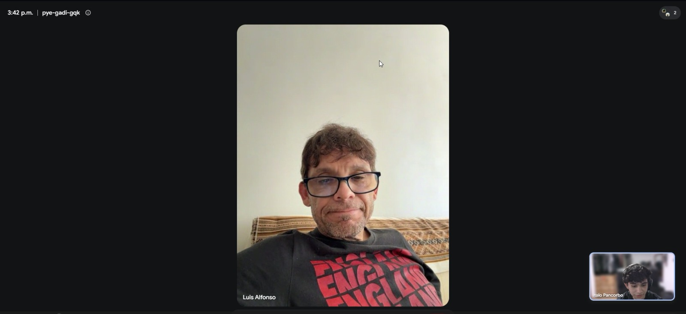
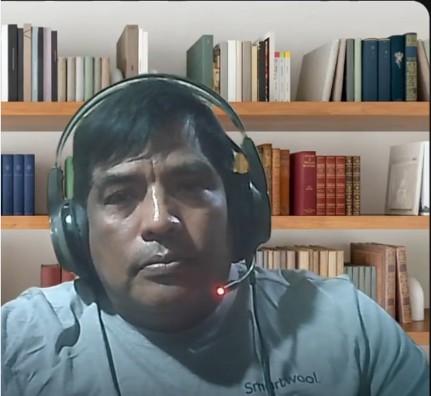
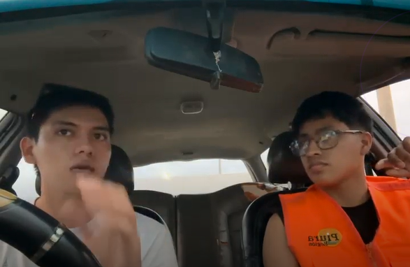

# Requirements Elicitation & Analysis

## 2.1 Competidores

### 2.1.1 Análisis Competitivo

| **¿Por qué llevar a cabo este análisis?** | El objetivo de este análisis competitivo es identificar las principales características, fortalezas, debilidades y enfoques de soluciones existentes relacionadas con el monitoreo ambiental y la gestión de proyectos de construcción. El contraste entre RoadWatch OS, SiteHive, Sonitus Systems y Autodesk Construction Cloud permite identificar oportunidades de diferenciación para la propuesta de VíaNexo, especialmente en la centralización de información ambiental, seguimiento de incidencias, trazabilidad de evidencias y apoyo a la gestión preventiva en proyectos viales. |
| :--- | :--- |

| **Categoría** | **RoadWatch OS (VíaNexo)** | **SiteHive** | **Sonitus Systems** | **Autodesk Construction Cloud** |
| :--- | :---: | :---: | :---: | :---: |
| **Cabecera** |  |  |  |  |
| **Perfil** | | | | |
| **Overview** | Plataforma web orientada a la gestión y supervisión ambiental de proyectos viales. Centraliza proyectos, puntos de monitoreo, mediciones, alertas, incidencias, acciones de mitigación, evidencias y reportes dentro de un mismo entorno digital. | Plataforma SaaS australiana especializada en monitoreo ambiental continuo de ruido, polvo y vibración para proyectos de construcción y minería. | Proveedor especializado en instrumentación y monitoreo ambiental mediante dispositivos para ruido y calidad del aire integrados con servicios en la nube. | Suite integral basada en la nube para la gestión de proyectos de construcción, coordinación, documentación y seguimiento de incidencias. |
| **Ventaja competitiva (valor al cliente)** | Integración de la gestión ambiental con el seguimiento de incidencias, acciones de mitigación, evidencias e información histórica dentro de una plataforma orientada específicamente a proyectos viales. La propuesta busca reducir la dispersión de información y facilitar una gestión preventiva y trazable. | Automatización del procesamiento de datos ambientales de campo y capacidades especializadas para monitoreo continuo en proyectos de construcción. | Especialización en equipos de medición ambiental y monitoreo remoto mediante instrumentación orientada al control de ruido y calidad ambiental. | Integración con herramientas de diseño y construcción del ecosistema Autodesk, permitiendo centralizar documentación, coordinación y seguimiento de proyectos. |
| **Perfil de Marketing** | | | | |
| **Mercado objetivo** | Empresas constructoras viales y empresas supervisoras o consultoras ambientales que gestionan uno o varios proyectos de infraestructura. | Empresas constructoras, contratistas y proyectos de infraestructura que requieren monitoreo ambiental continuo. | Consultoras ambientales, autoridades, empresas industriales y organizaciones que requieren monitoreo de ruido y calidad ambiental. | Empresas constructoras, consorcios de ingeniería, estudios de diseño y organizaciones responsables de gestionar proyectos de construcción. |
| **Estrategias de marketing** | Prospección B2B dirigida a empresas constructoras viales y consultoras ambientales, presencia en espacios especializados del sector y presentación de la propuesta mediante casos de uso relacionados con gestión ambiental, trazabilidad y seguimiento de incidencias. | Marketing de contenidos, presentación de casos de uso en proyectos de construcción y promoción de capacidades de monitoreo ambiental continuo. | Venta consultiva especializada, presencia en mercados de instrumentación ambiental y comercialización mediante distribuidores y canales especializados. | Marketing B2B global, ecosistema de socios comerciales, certificaciones profesionales y promoción integrada dentro del ecosistema Autodesk. |
| **Perfil de Producto** | | | | |
| **Productos & Servicios** | Plataforma web para la gestión y supervisión ambiental de proyectos viales, con registro y consulta de proyectos, puntos de monitoreo, mediciones, alertas, incidencias, acciones de mitigación, evidencias, historial y reportes. | Dispositivos de monitoreo ambiental y plataforma en la nube con visualización de datos, alertas y reportes. | Equipos de medición ambiental integrados con una plataforma web para consulta y análisis de información histórica. | Módulos de gestión de construcción, documentación, coordinación, incidencias, planos y colaboración entre participantes del proyecto. |
| **Precios & Costos** | Modelo de suscripción orientado a organizaciones, con diferentes niveles de servicio según funcionalidades, cantidad de usuarios, proyectos y capacidades disponibles. La implementación de pasarelas de pago reales no forma parte del MVP. | Modelo de contratación asociado al uso de dispositivos y servicios de monitoreo. | Comercialización de dispositivos de medición junto con servicios de acceso a plataforma y gestión de información. | Licenciamiento mediante suscripciones para usuarios y organizaciones, con diferentes planes según productos y capacidades contratadas. |
| **Canales de distribución** | Aplicación web responsiva accesible mediante navegador para empresas constructoras viales y empresas supervisoras o consultoras ambientales. | Plataforma web y servicios asociados al despliegue de dispositivos de monitoreo. | Plataforma web y distribución de equipos especializados mediante canales comerciales y representantes. | Plataforma web, aplicaciones móviles y herramientas integradas dentro del ecosistema Autodesk. |
| **Análisis SWOT** | *Las fortalezas permiten aprovechar oportunidades y sustentar la propuesta de diferenciación.* | | | |
| **Fortalezas** | Especialización en gestión ambiental para proyectos viales e integración de mediciones, alertas, incidencias, acciones de mitigación, evidencias e información histórica dentro de una misma plataforma. | Especialización en monitoreo ambiental continuo y experiencia en proyectos de construcción e infraestructura. | Experiencia en instrumentación ambiental y disponibilidad de equipos especializados de monitoreo. | Amplio ecosistema de herramientas para proyectos de construcción y elevada integración entre sus productos. |
| **Debilidades** | Producto en etapa inicial de desarrollo, con menor presencia en el mercado y menor madurez tecnológica que competidores internacionales consolidados. El alcance inicial contempla un conjunto limitado de variables y funcionalidades de monitoreo ambiental. | Su enfoque se concentra principalmente en monitoreo ambiental y puede requerir soluciones adicionales para gestionar procesos operativos posteriores a una incidencia. | Su propuesta se centra principalmente en instrumentación y monitoreo, por lo que la gestión operativa de incidencias puede depender de herramientas complementarias. | Su alcance es general para gestión de construcción y no está específicamente orientado a procesos de supervisión ambiental vial. |
| **Oportunidades** | Creciente necesidad de digitalizar los procesos de gestión y supervisión ambiental, centralizar información proveniente de diferentes proyectos y mejorar la trazabilidad de mediciones, incidencias y evidencias. | Expansión de proyectos que requieren monitoreo ambiental continuo y mayor trazabilidad de información. | Crecimiento de la demanda de instrumentación ambiental conectada y monitoreo remoto. | Incorporación progresiva de capacidades adicionales mediante integraciones y extensiones del ecosistema de construcción. |
| **Amenazas** | Presencia de proveedores internacionales consolidados, incorporación progresiva de funcionalidades ambientales en plataformas generales de construcción y posibilidad de que las empresas clientes mantengan procesos manuales existentes debido a costos o complejidad de adopción. | Entrada de nuevos proveedores especializados y plataformas con capacidades similares de monitoreo ambiental. | Competencia de fabricantes de equipos de menor costo y nuevas soluciones de monitoreo conectado. | Aparición de plataformas especializadas que resuelvan necesidades específicas de industrias o dominios que una solución generalista no cubre en profundidad. |

#### Síntesis del análisis competitivo

El análisis evidencia que las soluciones evaluadas cubren diferentes partes del problema. SiteHive y Sonitus Systems presentan capacidades especializadas de monitoreo ambiental mediante dispositivos y plataformas digitales, mientras que Autodesk Construction Cloud ofrece un entorno más amplio para la gestión de proyectos de construcción.

La oportunidad identificada para RoadWatch OS se encuentra en combinar el seguimiento de variables ambientales con la gestión operativa de incidencias, acciones de mitigación, responsables y evidencias dentro de un entorno orientado al contexto de proyectos viales.

Esta diferenciación no se plantea únicamente desde el registro o consulta de mediciones, sino desde la posibilidad de relacionar la información ambiental con las acciones posteriores que realizan las empresas constructoras y las empresas supervisoras o consultoras ambientales.

### 2.1.2. Estrategias y tácticas frente a competidores

A partir del análisis competitivo realizado, VíaNexo identifica oportunidades para diferenciar RoadWatch OS frente a plataformas especializadas en monitoreo ambiental, proveedores de instrumentación y soluciones generales de gestión de proyectos de construcción.

Las estrategias y tácticas propuestas buscan aprovechar las fortalezas identificadas en el análisis competitivo, responder a las principales debilidades observadas en las alternativas evaluadas y fortalecer la propuesta de valor de RoadWatch OS dentro del contexto de proyectos viales.

#### Estrategia 1: Integración de la gestión ambiental y el seguimiento operativo

Mientras algunas soluciones se concentran principalmente en la captura o visualización de mediciones ambientales, RoadWatch OS busca integrar en un mismo entorno la información necesaria para realizar seguimiento a los proyectos, mediciones, alertas, incidencias, acciones de mitigación y evidencias.

**Tácticas:**

- Centralizar la información ambiental de los diferentes proyectos y frentes de obra.
- Relacionar las mediciones con alertas, incidencias, responsables y acciones de mitigación.
- Asociar evidencias y documentos a las situaciones ambientales correspondientes.
- Mantener un historial que permita revisar las acciones realizadas durante el desarrollo del proyecto.

#### Estrategia 2: Orientación preventiva frente a posibles desviaciones ambientales

RoadWatch OS busca diferenciarse de los procesos principalmente reactivos mediante la identificación oportuna de mediciones que se acerquen o superen los umbrales ambientales configurados.

**Tácticas:**

- Comparar las mediciones registradas con los umbrales establecidos.
- Mostrar alertas cuando se identifiquen valores que requieran atención.
- Facilitar la consulta de información histórica para reconocer cambios en los indicadores ambientales.
- Permitir que los responsables identifiquen rápidamente los proyectos, frentes o puntos de monitoreo que necesitan revisión.

#### Estrategia 3: Centralización y trazabilidad de evidencias ambientales

Frente al uso fragmentado de hojas de cálculo, correos electrónicos, fotografías, documentos y aplicaciones de mensajería, RoadWatch OS busca mantener relacionada la información ambiental dentro de una misma plataforma.

**Tácticas:**

- Asociar fotografías, documentos y otros registros a las mediciones o incidencias correspondientes.
- Mantener un historial de evidencias y acciones realizadas.
- Facilitar la búsqueda y consulta de información por proyecto, fecha, punto de monitoreo u otros criterios.
- Reducir el tiempo necesario para localizar y consolidar información durante supervisiones, auditorías o fiscalizaciones.

#### Estrategia 4: Modelo de suscripción adaptable a las organizaciones

RoadWatch OS plantea un modelo de suscripción que permita a las organizaciones acceder a diferentes capacidades de la plataforma según sus necesidades y características operativas.

**Tácticas:**

- Definir diferentes niveles de servicio según las funcionalidades disponibles.
- Considerar límites relacionados con cantidad de usuarios, proyectos u otras capacidades de uso.
- Permitir que las organizaciones puedan cambiar de plan según sus necesidades.
- Facilitar una adopción progresiva de la plataforma sin requerir una inversión inicial en infraestructura tecnológica especializada.

#### Estrategia 5: Especialización en gestión ambiental de proyectos viales

A diferencia de soluciones generales para la gestión de proyectos de construcción, RoadWatch OS se orienta específicamente a las actividades de gestión y supervisión ambiental asociadas a proyectos de infraestructura vial.

**Tácticas:**

- Utilizar conceptos y flujos propios del dominio de gestión ambiental vial.
- Organizar la información por proyecto, tramo, frente de obra y punto de monitoreo.
- Priorizar funcionalidades relacionadas con mediciones ambientales, alertas, incidencias, acciones de mitigación, evidencias y reportes.
- Diseñar la experiencia de uso considerando las necesidades diferenciadas de empresas constructoras viales y empresas supervisoras o consultoras ambientales.

#### Estrategia 6: Supervisión consolidada de múltiples proyectos

RoadWatch OS busca ofrecer una visión organizada de varios proyectos para apoyar a las empresas supervisoras o consultoras ambientales que gestionan información proveniente de distintas obras y responsables.

**Tácticas:**

- Presentar información consolidada del estado ambiental de varios proyectos.
- Facilitar la identificación de proyectos con incidencias abiertas o situaciones que requieran atención.
- Permitir la consulta de indicadores, evidencias e historial de cada proyecto.
- Facilitar la generación y consulta de reportes para actividades de seguimiento y supervisión.
  
## 2.2 Entrevistas

### 2.2.1 Diseño de Entrevistas

Las entrevistas tienen como objetivo conocer cómo los representantes de los dos segmentos realizan actualmente las actividades relacionadas con la gestión y supervisión ambiental de proyectos viales, así como identificar sus principales necesidades, objetivos, dificultades, herramientas utilizadas y hábitos de trabajo.

Las preguntas fueron planteadas de manera abierta para evitar condicionar las respuestas de los participantes. Además de conocer el proceso actual, se busca recopilar información que permita identificar características comunes de cada segmento y construir posteriormente los User Personas.

Durante las entrevistas se recopilará información demográfica y profesional, experiencia, responsabilidades, herramientas de trabajo, dispositivos utilizados, canales de comunicación, objetivos, frustraciones y expectativas relacionadas con la gestión ambiental.

#### Preguntas de presentación

Estas preguntas se realizarán a los participantes de ambos segmentos:

1. ¿Cuál es su nombre y edad?

2. ¿En qué distrito reside actualmente?

3. ¿Cuál es su cargo y en qué tipo de empresa trabaja?

4. ¿Cuántos años de experiencia tiene en proyectos de infraestructura, construcción o gestión ambiental?

5. ¿Cuáles son sus principales responsabilidades dentro de su trabajo?

---

#### Segmento 1: Empresas Constructoras Viales

##### Preguntas principales

1. ¿Cómo es un día habitual de trabajo para usted cuando tiene que realizar seguimiento ambiental a uno o varios frentes de obra?

2. ¿Cómo realizan actualmente el registro de las mediciones ambientales, como ruido, material particulado o calidad del agua?

3. ¿Cómo organizan la información ambiental correspondiente a los diferentes proyectos, tramos o frentes de obra?

4. ¿Qué herramientas utilizan para registrar o consultar mediciones, fotografías, documentos y reportes ambientales?

5. Cuando se detecta una medición fuera de lo esperado o una posible desviación ambiental, ¿qué sucede desde que se identifica hasta que se atiende?

6. ¿Cómo asignan actualmente las acciones correctivas o medidas de mitigación a los responsables?

7. ¿Cómo realizan el seguimiento para saber si una incidencia o acción pendiente ya fue atendida?

8. ¿Qué dificultades encuentra al trabajar con varios proyectos o frentes de obra al mismo tiempo?

9. ¿Qué problemas suelen presentarse al momento de buscar mediciones, fotografías, documentos o evidencias anteriores?

10. ¿Cómo preparan actualmente la información cuando reciben una solicitud de la supervisión, una auditoría o una fiscalización?

11. ¿Qué parte del proceso de gestión ambiental considera que le consume más tiempo?

12. ¿Cuál es la situación que más le preocupa durante el seguimiento ambiental de una obra?

13. Si pudiera mejorar una sola parte del proceso actual, ¿cuál sería y por qué?

##### Preguntas complementarias

14. ¿Utiliza principalmente computadora, celular, tablet u otro dispositivo durante sus actividades de trabajo?

15. ¿Qué aplicaciones o canales utiliza con mayor frecuencia para comunicarse con el personal de campo y otros responsables?

16. ¿Qué tipo de información necesita revisar con mayor frecuencia durante el día?

17. ¿Prefiere revisar información mediante tablas, gráficos, mapas, reportes u otro formato? ¿Por qué?

18. ¿Qué tan cómodo se siente utilizando nuevas aplicaciones o herramientas digitales en su trabajo?

19. Cuando necesita tomar una decisión rápidamente, ¿qué información considera indispensable tener disponible?

20. ¿Qué características debería tener una herramienta para que realmente le resulte útil en su trabajo diario?

21. ¿Hay alguna aplicación, plataforma o herramienta digital que utilice frecuentemente y que considere especialmente sencilla o útil? ¿Qué le gusta de ella?

---

#### Segmento 2: Empresas Supervisoras y Consultoras Ambientales

##### Preguntas principales

1. ¿Cómo es un día habitual de trabajo cuando tiene que supervisar o revisar la información ambiental de uno o varios proyectos?

2. ¿Cómo recibe actualmente las mediciones ambientales provenientes de los proyectos que supervisa?

3. ¿Qué herramientas utiliza para organizar mediciones, documentos, fotografías, observaciones y reportes?

4. Cuando supervisa varios proyectos al mismo tiempo, ¿cómo identifica cuáles requieren mayor atención?

5. ¿Qué sucede cuando encuentra una medición, observación o situación que podría representar un problema ambiental?

6. ¿Cómo comunica actualmente una observación a la empresa responsable del proyecto?

7. ¿Cómo realiza el seguimiento para comprobar que una observación o incidencia haya sido atendida?

8. ¿Qué dificultades encuentra al revisar información proveniente de diferentes empresas, proyectos o responsables?

9. ¿Qué problemas suelen presentarse cuando necesita consultar información histórica de un proyecto?

10. ¿Cómo prepara actualmente la información necesaria para elaborar reportes, auditorías o procesos de fiscalización?

11. ¿Qué parte del proceso de supervisión ambiental considera que requiere mayor trabajo manual?

12. ¿Qué información considera más importante para conocer rápidamente el estado ambiental de un proyecto?

13. Si pudiera cambiar una sola parte del proceso actual de supervisión, ¿cuál sería y por qué?

##### Preguntas complementarias

14. ¿Utiliza principalmente computadora, celular, tablet u otro dispositivo para realizar sus actividades?

15. ¿Qué canales utiliza normalmente para comunicarse con las empresas constructoras o responsables de los proyectos?

16. ¿Con qué frecuencia necesita consultar información histórica, evidencias o reportes anteriores?

17. ¿Prefiere revisar la información mediante tablas, gráficos, mapas, indicadores u otro formato? ¿Por qué?

18. ¿Qué tan cómodo se siente utilizando nuevas plataformas digitales en sus actividades de supervisión?

19. Cuando existen varios proyectos con observaciones pendientes, ¿cómo decide cuál revisar primero?

20. ¿Qué características debería tener una herramienta digital para ayudarle a supervisar varios proyectos?

21. ¿Hay alguna aplicación o plataforma que utilice en su trabajo y cuya forma de presentar u organizar la información considere especialmente útil? ¿Por qué?

### 2.2.2 Registro de Entrevistas

Las entrevistas se realizaron a representantes de los dos segmentos objetivo definidos para RoadWatch OS. Para cada participante se registró información demográfica y profesional, evidencia audiovisual, duración de la entrevista y un resumen de los principales hallazgos obtenidos.

La información recopilada permitirá identificar características objetivas y subjetivas de cada segmento, incluyendo experiencia profesional, responsabilidades, herramientas utilizadas, dispositivos, canales digitales, objetivos, frustraciones, hábitos de trabajo y principales dificultades relacionadas con la gestión y supervisión ambiental.

### Segmento 1: Empresas Constructoras Viales

Los participantes de este segmento corresponden a profesionales involucrados en la gestión de proyectos viales y en actividades relacionadas con el seguimiento y cumplimiento ambiental de las obras.

#### Entrevista #1

| Campo | Información |
|---|---|
| Nombres | Luis Alfonso |
| Apellidos | Chávez Madueño|
| Edad | 52 |
| Distrito | Magdalena |
| Cargo | Lider de gestión de proyectos viales |
| Años de experiencia | 10 |
| Evidencia |  |
| Enlace de video | [Ver Grabación de la Presentación (OneDrive)](https://1drv.ms/v/c/113B281D1AF386CE/IQDx5UhtJiBUSYA9sO9lyRGlAVH-haEompaIjEUPeiuyzSk?e=Md1ybO) |
| Inicio de entrevista | 0:00|
| Duración | 17:54 |
| Resumen |Alfonso es un ingeniero industrial que lleva trabajando 10 años en el puesto de Lider de gestión de proyectos viales. Esto conforma la construcción de proyectos viales tanto terrestre y via férrea, su principal función es asegurarse con su equipo que los proyectos que se están llevando a cabo tengan los cumplimientos y normativas correctas. Comenta que lo máximo que se puede administrar son poco mas de 3 proyectos, de los cuales la prioridad suele ir enfocado a 1 de ellos, o al que tenga algún momento crítico o importante a tratarse. En cuanto a la comuniación, se maneja lo clásico, para la formalidad del caso se utiliza el correo y para consultas de información se emplea el uso de WhatsApp. Para su trabajo más que nada utiliza dispositivos portátiles (celular y laptop) para mantenrse al tanto de las situaciones en los disitintos proyectos. Nos comenta que mantener organizado el proyecto en general, tonmando en cuenta fotografías, mediciones e información, no es complicado, mas si duraedero al momento de utilizar softwares llamados Porject y Primavera. Lo que más le suele tomar tiempo para la realización de estos proyectos es la planificación, ya que es donde se tienen que tomar muchas medidas previas para evitar problemas de gestión o ambiental, ya que eso los haría perder presupuesto, tiempo y reputación.  |

#### Entrevista #2

| Campo | Información |
|---|---|
| Nombres | Alex Dante  |
| Apellidos | Quintanilla Pérez |
| Edad | 49 años |
| Distrito | San Juan de Lurigancho |
| Cargo | Jefe de SSOMA |
| Años de experiencia | 12 años |
| Evidencia |  |
| Enlace de video | [Ver video](https://upcedupe-my.sharepoint.com/:v:/g/personal/u20241e356_upc_edu_pe/IQDOHhvGbnQpQYQcNzJf3safAW7v3ItfV2NOiFdIGRSiGZc?nav=eyJyZWZlcnJhbEluZm8iOnsicmVmZXJyYWxBcHAiOiJTdHJlYW1XZWJBcHAiLCJyZWZlcnJhbFZpZXciOiJTaGFyZURpYWxvZy1MaW5rIiwicmVmZXJyYWxBcHBQbGF0Zm9ybSI6IldlYiIsInJlZmVycmFsTW9kZSI6InZpZXcifX0%3D&e=7eKvFx) |
| Duración | 0:00 - 3:16 |
| Resumen | Alex Dante Quintanilla Pérez es Jefe de SSOMA con 12 años de experiencia en construcción vial. Actualmente gestiona 3 proyectos simultáneos con múltiples frentes de obra, lo que le obliga a delegar constantemente en supervisores de campo al no poder estar presente en todos los puntos a la vez. El registro de mediciones ambientales se realiza de forma manual mediante formatos físicos que luego se trasladan a hojas de cálculo Excel, y las evidencias fotográficas se comparten por WhatsApp o Messenger, reconociendo que no es el método ideal pero es el disponible actualmente. Ante una incidencia reciente de niveles de ruido elevados cerca de una zona residencial, la coordinación se realizó por llamadas telefónicas y la documentación se gestionó en un archivo Word, sin un sistema centralizado de seguimiento formal. Su mayor dificultad es la pérdida de tiempo al buscar registros históricos dispersos en múltiples archivos y grupos de WhatsApp, pudiendo tomar hasta media hora localizar información de un mes específico. Señala además que toda notificación depende de que alguien recuerde avisar manualmente, sin ningún tipo de alerta automática. Las consecuencias de no detectar un incumplimiento a tiempo incluyen multas, paralización de obra y pérdida del contrato en proyectos públicos. Como mejora principal, identifica la necesidad de un panel centralizado con visibilidad en tiempo real del estado de todos sus puntos de monitoreo y alertas automáticas ante sobrepasos de límites normativos, sin depender de terceros para enterarse de una desviación.|

#### Entrevista #3

<table>
<thead>
  <tr>
    <th colspan="2">Entrevista #3</th>
  </tr>
</thead>
<tbody>
  <tr>
    <td>Nombres</td>
    <td>José Luis</td>
  </tr>
  <tr>
    <td>Apellidos</td>
    <td>Pérez Ramírez</td>
  </tr>
  <tr>
    <td>Edad</td>
    <td>28</td>
  </tr>
  <tr>
    <td>Ciudad</td>
    <td>Piura</td>
  </tr>
  <tr>
    <td>Cargo</td>
    <td>Gestor Ambiental de Proyectos</td>
  </tr>
  <tr>
    <td>Años de experiencia</td>
    <td>7 años (2 en empresa privada y 5 en la municipalidad)</td>
  </tr>
  <tr>
    <td>Evidencia</td>
    <td></td>
  </tr>
  <tr>
    <td>Link</td>
    <td><a href="https://upcedupe-my.sharepoint.com/:v:/g/personal/u20241g031_upc_edu_pe/IQCMhQ7MolsyRKtp8PIvyZf8AYI-jf1wqdwDhOm84XWl-X8" target="_blank">Ver video</a></td>
  </tr>
  <tr>
    <td>Duración</td>
    <td>0:00 - 8:52</td>
  </tr>
  <tr>
    <td>Resumen</td>
    <td>José Luis, un Gestor Ambiental de Proyectos en Piura con 7 años de experiencia, supervisa actualmente de 10 a 30 proyectos de construcción y áreas verdes de forma simultánea. Las principales dificultades en su trabajo radican en la recolección y centralización de datos ambientales, los cuales recibe principalmente a través de WhatsApp en forma de mensajes, fotos e informes, los que posteriormente él mismo debe vaciar y organizar en tablas de Excel. A José Luis le frustra la falta de herramientas modernas, ya que los métodos tradicionales que emplea resultan lentos y dependen de su presencia física o la impresión de documentos para acceder a la información cuando no está en su oficina. Su objetivo principal es asegurar que los proyectos cumplan con la normativa y los estándares medioambientales planificados. Para mejorar su labor, propone la implementación de una herramienta o plataforma digital que unifique el registro de datos y agilice la comunicación con su equipo, permitiendo el acceso en tiempo real a la información de cada proyecto sin depender del Excel o WhatsApp, buscando que su flujo de trabajo sea más fluido y eficiente.</td>
  </tr>
</tbody>
</table>

### Segmento 2: Empresas Supervisoras y Consultoras Ambientales

Los participantes de este segmento corresponden a profesionales responsables de actividades de supervisión, consultoría, auditoría o seguimiento ambiental de uno o varios proyectos.

#### Entrevista #1

| Campo | Información |
|---|---|
| Nombres | Pendiente |
| Apellidos | Pendiente |
| Edad | Pendiente |
| Distrito | Pendiente |
| Cargo | Pendiente |
| Años de experiencia | Pendiente |
| Evidencia | Pendiente |
| Enlace de video | Pendiente |
| Inicio de entrevista | Pendiente |
| Duración | Pendiente |
| Resumen | Pendiente de actualización con la nueva entrevista. |

#### Entrevista #2

<table>
<thead>
  <tr>
    <th colspan="2">Entrevista #2</th>
  </tr>
</thead>
<tbody>
  <tr>
    <td>Nombre</td>
    <td>Guadalupe</td>
  </tr>
  <tr>
    <td>Apellidos</td>
    <td>Kim Chang</td>
  </tr>
  <tr>
    <td>Edad</td>
    <td>44</td>
  </tr>
  <tr>
    <td>Distrito</td>
    <td>San Isidro</td>
  </tr>
  <tr>
    <td>Evidencia</td>
    <td></td>
  </tr>
  <tr>
    <td>Link</td>
    <td><a href="https://upcedupe-my.sharepoint.com/:v:/g/personal/u202410421_upc_edu_pe/IQAzGWBr_180TaX5r2Ce2iHmAa0uzBUXWMWKYnJheWzFmdM?e=lzPTKe&nav=eyJyZWZlcnJhbEluZm8iOnsicmVmZXJyYWxBcHAiOiJTdHJlYW1XZWJBcHAiLCJyZWZlcnJhbFZpZXciOiJWaWV3IiwicmVmZXJyYWxBcHBQbGF0Zm9ybSI6IldlYiIsInJlZmVycmFsTW9kZSI6InZpZXcifX0%3D" target="_blank">Ver video</a></td>
  </tr>
  <tr>
    <td>Duración</td>
    <td>0:00 - 5:34</td>
  </tr>
  <tr>
    <td>Resumen</td>
    <td>Guadalupe desempeña funciones de supervisión y coordinación, realizando seguimiento a diferentes actividades y proyectos, revisando información, verificando el cumplimiento de procesos y coordinando con los responsables cuando se detectan observaciones o incidencias. Para el seguimiento ambiental utiliza principalmente reportes, hojas de cálculo, informes, correos electrónicos, carpetas compartidas y WhatsApp, lo que genera que la información se encuentre distribuida en diversos canales. Esta fragmentación dificulta localizar rápidamente mediciones, documentos, fotografías, incidencias y acciones correctivas, especialmente cuando se supervisan varios proyectos de manera simultánea. Además, señala que el seguimiento suele ser reactivo debido a que las mediciones no siempre están disponibles de forma inmediata y que el control de incidencias abiertas y acciones pendientes requiere una revisión manual. Guadalupe considera que una plataforma centralizada con alertas preventivas permitiría mejorar significativamente este proceso, especialmente si incorpora estados visuales como verde, amarillo y rojo para identificar rápidamente situaciones normales, de atención o críticas. Asimismo, considera útil integrar sensores para obtener información continua y facilitar la supervisión remota, sin reemplazar completamente las visitas presenciales. Destaca también la importancia de conservar un historial completo de mediciones, incidencias, responsables, acciones correctivas y evidencias para auditorías o fiscalizaciones. Finalmente, considera que una solución ideal debería ofrecer una vista general de todos los proyectos, visualización geográfica mediante mapas, alertas automáticas y generación de reportes descargables en PDF o Excel, reduciendo así el trabajo manual y facilitando la toma de decisiones.</td>
  </tr>
</tbody>
</table>

#### Entrevista #3

<table>
<thead>
  <tr>
    <th colspan="2">Entrevista #3</th>
  </tr>
</thead>
<tbody>
  <tr>
    <td>Nombres</td>
    <td>Rosa Mariel</td>
  </tr>
  <tr>
    <td>Apellidos</td>
    <td>Montes Chang</td>
  </tr>
  <tr>
    <td>Edad</td>
    <td>23</td>
  </tr>
  <tr>
    <td>Distrito</td>
    <td>Santa, Chimbote</td>
  </tr>
  <tr>
    <td>Cargo</td>
    <td>Ingeniera de Proyectos</td>
  </tr>
  <tr>
    <td>Años de experiencia</td>
    <td>3 años</td>
  </tr>
  <tr>
    <td>Evidencia</td>
    <td></td>
  </tr>
  <tr>
    <td>Link</td>
    <td><a href="https://upcedupe-my.sharepoint.com/:v:/g/personal/u20241g031_upc_edu_pe/IQDGfGytNgvfQ4rcVobTw5pWAZyAVgsiLJHVdPOQr6odWDw" target="_blank">Ver video</a></td>
  </tr>
  <tr>
    <td>Duración</td>
    <td>0:00 - 13:56</td>
  </tr>
  <tr>
    <td>Resumen</td>
    <td>Rosa Mariel, de 23 años, es Ingeniera de Proyectos con 3 años de experiencia trabajando en empresas del rubro pesquero, naval y metalmecánico. En su rol, supervisa hasta 10 proyectos de manera simultánea durante temporada alta, compartiendo funciones administrativas, de oficina y de campo, tales como el control de cronogramas y estándares de calidad y seguridad. En el ámbito ambiental, su principal dificultad es el proceso de registro de datos, específicamente con los formatos físicos (en papel) para la segregación de residuos. Rosa indica que, debido a la falta de practicidad y el apuro diario, estos documentos muchas veces no se llenan, lo cual es un riesgo grave ante auditorías inopinadas de entidades reguladoras como la OEFA, pudiendo derivar en multas o sanciones. Actualmente, la comunicación interna se apoya en WhatsApp para el envío de fotografías, y herramientas como Power BI o Looker Studio para presentar reportes al cliente, pero el acceso a esta información desde el celular es limitado y poco práctico cuando está en campo. Para mejorar el proceso, Rosa considera crucial la implementación de una plataforma digital o aplicación propia que agilice la fase de registro, eliminando la dependencia del papel y asegurando que toda la documentación ambiental esté siempre consolidada, accesible y lista para cualquier fiscalización.</td>
  </tr>
</tbody>
</table>

### 2.2.3 Análisis de Entrevistas

**Segmento 1: Líderes o jefes de gestión de proyectos viales – Empresas Constructoras**

| Característica                                             | Mención |   %   | Evidencia                                                                                                                                                                                            |
| :--------------------------------------------------------- | :-----: | :---: | :--------------------------------------------------------------------------------------------------------------------------------------------------------------------------------------------------- |
| Uso de herramientas y canales fragmentados                 |   3/3   |  100% | Keler, Becker y Jaime utilizan Excel, WhatsApp, correos, carpetas compartidas, informes y otros medios separados para gestionar mediciones y evidencias ambientales.                                 |
| Dificultad para organizar información de múltiples frentes |   3/3   |  100% | Los entrevistados señalan que gestionar varios frentes simultáneamente dificulta mantener actualizados y correctamente asociados los documentos, mediciones, fotografías y evidencias.               |
| Necesidad de una plataforma centralizada                   |   3/3   |  100% | Los tres entrevistados consideran necesario disponer de una plataforma que concentre mediciones, incidencias, responsables, acciones y evidencias de todos los frentes de obra.                      |
| Interés en sensores y alertas preventivas                  |   3/3   |  100% | Keler, Becker y Jaime consideran beneficioso utilizar sensores IoT y alertas automáticas para detectar anticipadamente valores cercanos a los límites ambientales permitidos.                        |
| Seguimiento ambiental principalmente manual o reactivo     |   3/3   |  100% | Las mediciones y comunicaciones dependen actualmente de registros manuales, reportes periódicos o de que el personal detecte y comunique oportunamente una situación de riesgo.                      |
| Necesidad de visibilidad en tiempo real                    |   3/3   |  100% | Los entrevistados manifiestan la necesidad de conocer oportunamente lo que ocurre en cada tramo para evitar reaccionar cuando el incumplimiento o la observación ya se produjo.                      |
| Importancia de la trazabilidad de incidencias y evidencias |   3/3   |  100% | Se requiere mantener información asociada al tramo, fecha, punto de monitoreo, responsables, acciones ejecutadas y evidencias que permitan reconstruir el historial de una incidencia.               |
| Riesgo de sanciones, observaciones o paralizaciones        |   3/3   |  100% | Una preocupación recurrente es detectar los problemas ambientales antes de que generen observaciones de supervisión, multas, incumplimientos o paralizaciones de la obra.                            |
| Necesidad de gestionar acciones de mitigación              |   3/3   |  100% | Ante una incidencia se deben ejecutar acciones como riego de vías, control de velocidad, modificación de horarios u otras medidas, además de verificar posteriormente su cumplimiento.               |
| Dificultad para consolidar información para auditorías     |   2/3   | 66.7% | Keler y Becker destacan especialmente el tiempo invertido en localizar fotografías, mediciones y documentos dispersos para preparar expedientes solicitados durante supervisiones o fiscalizaciones. |

**Insights Destacados**

* La **fragmentación de la información** constituye uno de los principales problemas del segmento, ya que las mediciones, fotografías, documentos y comunicaciones se encuentran distribuidos entre Excel, WhatsApp, correos y carpetas compartidas.
* Existe una necesidad generalizada de pasar de una gestión ambiental **reactiva a una gestión preventiva**, detectando tendencias de riesgo antes de que un indicador supere los límites establecidos.
* El **100% de los entrevistados considera útil centralizar la información** de los diferentes frentes de obra en una única plataforma que permita visualizar indicadores, incidencias, responsables, acciones correctivas y evidencias.
* La incorporación de **sensores IoT y alertas automáticas** es percibida como una oportunidad para mejorar la capacidad de respuesta y reducir el riesgo de observaciones, multas o paralizaciones.
* La **trazabilidad histórica y documental** representa un aspecto crítico, especialmente para demostrar las acciones realizadas frente a una incidencia y responder de manera más eficiente ante auditorías o fiscalizaciones.

---

**Segmento 2: Empresas Supervisoras y Consultoras Ambientales – Múltiples Proyectos**

| Característica                                                        | Mención |   %   | Evidencia                                                                                                                                                                                       |
| :-------------------------------------------------------------------- | :-----: | :---: | :---------------------------------------------------------------------------------------------------------------------------------------------------------------------------------------------- |
| Uso de múltiples herramientas para gestionar información              |   3/3   |  100% | Angiela, Guadalupe y Guillermo utilizan principalmente Excel, correos electrónicos, WhatsApp, documentos PDF, carpetas compartidas y reportes para realizar el seguimiento ambiental.           |
| Dificultad para consolidar información de varios proyectos            |   3/3   |  100% | Los entrevistados indican que supervisar múltiples proyectos genera grandes cantidades de mediciones, fotografías, informes y observaciones distribuidas en distintos archivos y formatos.      |
| Necesidad de centralizar la información                               |   3/3   |  100% | Los tres participantes consideran que una plataforma centralizada permitiría revisar los diferentes proyectos sin depender de numerosos archivos, carpetas y canales de comunicación.           |
| Dificultad para obtener una visión global del estado de los proyectos |   3/3   |  100% | Actualmente resulta complicado identificar rápidamente qué proyecto presenta una incidencia, cuál posee acciones pendientes o cuál requiere mayor atención.                                     |
| Seguimiento manual de incidencias y acciones correctivas              |   3/3   |  100% | El seguimiento se realiza mediante matrices de Excel, correos, reuniones, reportes y revisión manual de evidencias entregadas por los responsables de cada proyecto.                            |
| Interés en sensores y monitoreo continuo                              |   3/3   |  100% | Los entrevistados consideran útil disponer de información obtenida mediante sensores para mejorar la supervisión y detectar con mayor rapidez cambios en los indicadores ambientales.           |
| Necesidad de alertas preventivas                                      |   2/3   | 66.7% | Angiela y Guadalupe destacan directamente la utilidad de contar con alertas que permitan identificar situaciones críticas o próximas a un incumplimiento antes de que el problema se agrave.    |
| Importancia del historial y trazabilidad                              |   3/3   |  100% | Se considera necesario disponer de registros históricos de mediciones, incidencias, responsables, acciones correctivas y evidencias para sustentar revisiones y fiscalizaciones.                |
| Dificultad para preparar auditorías e informes                        |   3/3   |  100% | La dispersión de mediciones, fotografías y documentos incrementa el tiempo requerido para consolidar información y elaborar expedientes o informes de cumplimiento.                             |
| Necesidad de geolocalización y ubicación de puntos de monitoreo       |   2/3   | 66.7% | Guadalupe destaca la visualización mediante mapas y Guillermo señala la importancia de conocer la ubicación exacta de cada punto de monitoreo para contextualizar correctamente las mediciones. |

**Insights Destacados**

* Las empresas supervisoras y consultoras enfrentan una fuerte **carga administrativa causada por la dispersión de información** proveniente de distintos proyectos, empresas y responsables.
* Existe una necesidad común de disponer de una **vista consolidada multiproyecto** que permita identificar rápidamente proyectos críticos, observaciones abiertas y acciones correctivas pendientes.
* El **100% de los entrevistados considera necesaria la centralización de mediciones, evidencias, incidencias e historial**, especialmente para reducir el tiempo dedicado a consolidar información manualmente.
* La incorporación de **sensores, alertas y visualización continua de indicadores** permitiría fortalecer la supervisión remota y detectar situaciones que requieren atención antes de convertirse en incumplimientos.
* La **trazabilidad y confiabilidad de los datos** son especialmente relevantes para este segmento, debido a que la información debe utilizarse posteriormente como sustento durante auditorías, fiscalizaciones y elaboración de informes oficiales.

---

## 2.3 Needfinding

### 2.3.1. User Personas

**Segmento 1**

Para el Segmento 1 (Empresas Constructoras Viales / Módulo Operativo) se elaboró el User Persona Carlos Mendoza. Se consideraron factores como su rol de Jefe de Proyectos Viales en una empresa constructora en Lima, su experiencia de más de 10 años liderando obras viales y su responsabilidad de coordinar múltiples frentes de trabajo asegurando el avance físico y el cumplimiento de las normativas ambientales aplicables. Sus principales objetivos se centran en mantener la continuidad de la obra sin paralizaciones, recibir alertas preventivas antes de exceder los límites permitidos de polvo o ruido y centralizar las evidencias fotográficas junto con los datos obtenidos en campo. Sus principales frustraciones se relacionan con la dispersión de información en herramientas como WhatsApp, Excel y correo, la falta de visibilidad sobre posibles eventos contaminantes lejanos, la respuesta tardía provocada por mediciones manuales y la pérdida de tiempo al preparar descargos para la supervisión. Asimismo, se tomó en cuenta su alto nivel de competencias en gestión del tiempo, organización, planificación y toma de decisiones, así como su necesidad de contar con una plataforma en la nube con telemetría IoT en tiempo real, notificaciones instantáneas ante riesgos de desviación y un sistema que permita realizar el seguimiento de las acciones correctivas. Todo ello orientado a reducir riesgos de multas o paralizaciones, optimizar el tiempo del equipo técnico y proteger la reputación de la empresa constructora.

**Segmento 2**

Para el Segmento 2 (Empresas Supervisoras Ambientales / Consultoras - Módulo de Fiscalización) se elaboró el User Persona Gisela Chavez. Se consideraron factores como su rol de Directora de Operaciones en una consultora ambiental, su vasta experiencia liderando auditorías y fiscalizaciones de proyectos de transporte a nivel nacional, y su necesidad de auditar el cumplimiento regulatorio de múltiples frentes de obra de forma transparente e imparcial. Sus principales frustraciones se relacionan con la falta de visibilidad centralizada por la dispersión de informes fragmentados provenientes de distintas constructoras, la pérdida de tiempo administrativo al navegar entre correos o reportes estáticos y la fricción que se genera al existir discrepancias de datos sobre posibles incumplimientos ambientales. Asimismo, se tomó en cuenta su alto nivel de competencias en gestión y planificación, y su necesidad de una plataforma SaaS que permita unificar los datos de cumplimiento en tiempo real, automatizar la generación de reportes oficiales respaldados por datos inalterables y priorizar la atención de auditorías mediante métricas claras de riesgo.

### 2.3.2. User Task Matrix

El User Task Matrix permite identificar y comparar las principales tareas que realizan los User Personas de los dos segmentos objetivo de RoadWatch OS para cumplir sus responsabilidades actuales.

Las tareas descritas corresponden a actividades que existen independientemente de la solución propuesta. Por lo tanto, no representan funcionalidades de RoadWatch OS, sino acciones propias del trabajo cotidiano de los usuarios dentro de los procesos de gestión y supervisión ambiental de proyectos viales.

Los User Personas considerados son:

- **Carlos Mendoza:** representante del Segmento 1, correspondiente a empresas constructoras viales.
- **Gisela Chavez:** representante del Segmento 2, correspondiente a empresas supervisoras y consultoras ambientales.

Para cada tarea se evalúa su frecuencia y nivel de importancia dentro de las actividades de cada User Persona.

| Task | Carlos Mendoza - Frequency | Carlos Mendoza - Importance | Gisela Chavez - Frequency | Gisela Chavez - Importance |
|---|---|---|---|---|
| Revisar el estado ambiental de los proyectos o frentes de obra | Daily | Critical | Daily | Critical |
| Revisar mediciones ambientales registradas en campo | Daily | Critical | Weekly | High |
| Coordinar con responsables ambientales y personal de campo | Daily | High | Daily | High |
| Verificar el cumplimiento de compromisos y requisitos ambientales | Daily | Critical | Daily | Critical |
| Identificar posibles desviaciones o incumplimientos ambientales | Daily | Critical | Daily | Critical |
| Solicitar o recopilar evidencias de las actividades realizadas | Daily | High | Daily | High |
| Revisar fotografías, documentos y registros asociados a incidencias | Daily | High | Daily | High |
| Coordinar acciones correctivas o de mitigación | When required | Critical | When required | High |
| Realizar seguimiento a acciones correctivas pendientes | Daily | High | Daily | Critical |
| Organizar información por proyecto, tramo o punto de monitoreo | Daily | High | Daily | Critical |
| Consultar información histórica de mediciones e incidencias | Weekly | Medium | Weekly | High |
| Consolidar información proveniente de diferentes fuentes | Weekly | High | Daily | Critical |
| Preparar reportes de seguimiento ambiental | Weekly | High | Weekly | Critical |
| Preparar documentación para supervisiones, auditorías o fiscalizaciones | Monthly | Critical | Monthly | Critical |
| Comunicar observaciones o incidencias a los responsables correspondientes | When required | High | When required | Critical |
| Verificar el cierre de observaciones o incidencias | When required | High | When required | Critical |
| Supervisar varios proyectos o frentes de manera simultánea | Daily | High | Daily | Critical |

#### Análisis del User Task Matrix

La matriz evidencia que ambos User Personas comparten varias actividades relacionadas con el seguimiento ambiental, revisión de mediciones, gestión de evidencias, identificación de incidencias y verificación del cumplimiento de requisitos ambientales.

Para **Carlos Mendoza**, las tareas con mayor frecuencia e importancia están relacionadas con la operación diaria de los frentes de obra. Entre ellas destacan la revisión de mediciones ambientales, la coordinación con el personal de campo, la identificación de posibles desviaciones y la ejecución o seguimiento de medidas correctivas. Su trabajo requiere reaccionar rápidamente ante situaciones que puedan afectar la continuidad de la obra o generar observaciones ambientales.

Para **Gisela Chavez**, además de revisar el cumplimiento ambiental, adquieren especial importancia las tareas relacionadas con la consolidación de información proveniente de distintos proyectos, el seguimiento de observaciones pendientes y la preparación de documentación para auditorías, fiscalizaciones o reportes de cumplimiento. Debido a que supervisa múltiples proyectos, necesita mantener una visión global y organizada de la información recibida.

Las principales coincidencias entre ambos perfiles se encuentran en la necesidad de revisar información ambiental, identificar problemas, coordinar con responsables y mantener evidencias de las acciones realizadas. Sin embargo, mientras Carlos concentra su actividad en la gestión operativa de los frentes de obra, Gisela tiene una mayor responsabilidad sobre la supervisión, consolidación y validación de información proveniente de varios proyectos.

Estas diferencias permiten comprender las necesidades particulares de cada segmento sin asociarlas todavía a funcionalidades específicas de RoadWatch OS.

### 2.3.3. User Journey Mapping

**Segmento 1**

El User Journey Map de Carlos Mendoza representa el recorrido actual que sigue durante la gestión ambiental de un proyecto vial. El análisis se centra en las actividades, dificultades y puntos de dolor que forman parte de su proceso de trabajo actual, previo a la implementación de RoadWatch OS.

El recorrido comprende las siguientes etapas: 1. Planificación del frente de obra y revisión de requisitos ambientales, 2. Registro de mediciones y evidencias en campo, 3. Identificación de posibles desviaciones o excedencias ambientales, 4. Coordinación y ejecución de acciones correctivas o de mitigación, 5. Consolidación de información para reportes periódicos y 6. Preparación de documentación para supervisiones o auditorías.

Los principales puntos de dificultad se presentan durante el registro de información, la identificación oportuna de desviaciones y la consolidación de evidencias. Actualmente, las mediciones, fotografías, reportes y comunicaciones pueden encontrarse distribuidos entre hojas de cálculo, aplicaciones de mensajería, correos electrónicos y documentos compartidos.

Esta dispersión obliga a Carlos y a su equipo a revisar manualmente distintas fuentes para conocer el estado ambiental de los frentes de obra. Cuando la información no está disponible oportunamente, existe el riesgo de identificar una desviación después de que esta ya haya ocurrido.

Durante la preparación de reportes, supervisiones o auditorías también es necesario localizar y organizar evidencias provenientes de diferentes responsables y momentos del proyecto, incrementando el tiempo dedicado a tareas administrativas y dificultando la trazabilidad de las acciones realizadas.

**Segmento 2**

El User Journey Map de Gisela Chavez representa el recorrido actual que sigue durante la supervisión ambiental de múltiples proyectos. El análisis se centra en las actividades, dificultades y puntos de dolor que forman parte de su proceso de trabajo actual, previo a la implementación de RoadWatch OS.

El recorrido comprende las siguientes etapas: 1. Incorporación de un nuevo proyecto a la cartera de supervisión, 2. Revisión periódica del estado ambiental de los proyectos, 3. Solicitud y revisión de mediciones, informes y evidencias, 4. Identificación y comunicación de observaciones, 5. Seguimiento de acciones correctivas y 6. Consolidación de información para reportes y fiscalizaciones.

Los principales puntos de dificultad se presentan durante la revisión simultánea de varios proyectos y la recopilación de información proveniente de diferentes empresas y responsables.

Actualmente, Gisela debe consultar correos electrónicos, documentos, hojas de cálculo, carpetas compartidas y otros canales para verificar el estado de las observaciones y acciones pendientes. Esta fragmentación dificulta obtener rápidamente una visión general de la situación ambiental de cada proyecto.

Además, durante la elaboración de reportes o procesos de fiscalización, debe consolidar manualmente mediciones, documentos y evidencias generadas en distintos momentos, lo que incrementa el tiempo requerido para validar la información y mantener la trazabilidad de las observaciones realizadas.

### 2.3.4. Empathy Mapping

**Segmento 1**

Para el Empathy Mapping del Segmento 1 se tomó como referencia a Carlos Mendoza, quien representa a los responsables de proyectos en empresas constructoras viales.

Carlos trabaja coordinando distintos frentes de obra y debe estar pendiente tanto del avance del proyecto como del cumplimiento de los aspectos ambientales. Durante su trabajo revisa mediciones, reportes, fotografías y documentos enviados por el personal de campo. También coordina con los responsables cuando aparece algún problema o cuando se necesita aplicar una medida de mitigación.

En su día a día ve mucha información distribuida entre Excel, WhatsApp, correos, carpetas compartidas y documentos. Esto hace que muchas veces tenga que revisar varias fuentes antes de entender qué está pasando en un frente de obra.

Carlos escucha constantemente indicaciones de la gerencia sobre los plazos del proyecto, reportes del personal de campo y observaciones relacionadas con el cumplimiento ambiental. Cuando aparece una incidencia necesita comunicarse con los responsables, pedir información y verificar qué acciones se realizaron.

Una de sus principales preocupaciones es enterarse tarde de una posible desviación ambiental. También le genera frustración tener que invertir tiempo buscando fotografías, mediciones o documentos cuando necesita preparar un reporte o responder a una supervisión.

Entre sus principales dificultades se encuentran la información dispersa, el seguimiento manual de incidencias, la demora en recibir algunos reportes y la dificultad para mantener ordenadas las evidencias de cada frente de obra.

Carlos espera poder trabajar con información más organizada, reducir el tiempo que dedica a buscar documentos y tener mayor claridad sobre el estado de los diferentes frentes y las acciones que todavía están pendientes.

**Segmento 2**

Para el Empathy Mapping del Segmento 2 se tomó como referencia a Gisela Chavez, quien representa a los responsables de supervisión y consultoría ambiental que trabajan con varios proyectos al mismo tiempo.

Gisela debe revisar información proveniente de distintas empresas y responsables, verificar el cumplimiento ambiental de los proyectos y hacer seguimiento a observaciones, incidencias y acciones correctivas. Parte importante de su trabajo consiste en revisar reportes, documentos, fotografías y mediciones antes de preparar informes o responder a una fiscalización.

En su día a día recibe información por correo, Excel, documentos PDF, carpetas compartidas y aplicaciones de mensajería. Al manejar varios proyectos de manera simultánea, muchas veces necesita revisar diferentes fuentes para conocer el estado de una observación o confirmar si una acción pendiente ya fue atendida.

Gisela escucha solicitudes de gerencia, comunicaciones de los responsables de los proyectos y observaciones relacionadas con el cumplimiento ambiental. También debe coordinar con diferentes personas cuando falta información o cuando necesita aclarar algún dato antes de incluirlo en un informe.

Una de sus principales preocupaciones es no contar a tiempo con toda la información necesaria para revisar correctamente un proyecto. También le genera frustración tener que consolidar manualmente documentos provenientes de diferentes fuentes y volver a solicitar información cuando esta llega incompleta o desordenada.

Entre sus principales dificultades se encuentran la dispersión de la información, el seguimiento manual de observaciones, la cantidad de documentos que debe revisar y el tiempo que toma consolidar información de varios proyectos.

Gisela espera poder tener la información mejor organizada, revisar con mayor facilidad el estado de cada proyecto y reducir el tiempo que dedica a buscar, validar y consolidar documentos para reportes, auditorías o fiscalizaciones.

## 2.4. Big Picture EventStorming

### Paso 1 – Exploración no estructurada

En esta primera etapa, el equipo realizó una exploración abierta del dominio relacionado con la gestión y supervisión ambiental de proyectos viales.

El objetivo fue identificar los principales eventos que ocurren durante el seguimiento ambiental de una obra, considerando las actividades realizadas por empresas constructoras, supervisores, consultores ambientales y demás responsables involucrados.

Durante esta exploración se identificaron eventos como la asignación de nuevos tramos viales, la definición de puntos de monitoreo ambiental, el registro de niveles de ruido y material particulado, la identificación de excedencias, la revisión de medidas de mitigación y la preparación de documentación para supervisiones o fiscalizaciones.

También se reconocieron situaciones problemáticas dentro del proceso actual, como discrepancias entre reportes de la constructora y la supervisión, riesgo de incumplimientos ambientales, actualización manual de registros y consolidación tardía de documentación.

Los eventos identificados en esta primera etapa se colocaron sin seguir inicialmente un orden cronológico, con la finalidad de obtener una visión amplia de las situaciones que forman parte del dominio.

### Paso 2 – Línea de tiempo

Luego de identificar los principales eventos del dominio, el equipo los organizó en una línea de tiempo para representar de manera más clara cómo se desarrolla el proceso de gestión y supervisión ambiental de un proyecto vial.

Los eventos fueron agrupados en cinco etapas principales:

**1. Preparación**

En esta etapa se inicia el proceso con la asignación de un nuevo tramo vial a la empresa constructora y la definición de los puntos de monitoreo ambiental que serán considerados durante el proyecto.

Eventos principales:

- Nuevo tramo vial asignado a la empresa constructora.
- Puntos de monitoreo ambiental definidos.

**2. Monitoreo en campo**

Durante la ejecución de las actividades se realizan registros de las principales variables ambientales y se identifican posibles desviaciones respecto de los valores establecidos.

Eventos principales:

- Niveles de ruido y material particulado registrados.
- Umbral de ruido excedido en tramo urbano.

**3. Identificación del problema**

Cuando se detecta una situación que requiere atención, se revisa la información disponible y se identifican posibles diferencias entre los registros de los distintos participantes del proyecto.

Eventos principales:

- Discrepancia encontrada entre reportes de la constructora y la supervisión.
- Riesgo de incumplimiento ambiental identificado por la supervisión.

**4. Seguimiento y consolidación**

Después de identificar el problema, se revisan las medidas de mitigación aplicadas, se actualizan los registros ambientales y se organiza la documentación necesaria para sustentar las acciones realizadas.

Eventos principales:

- Medidas de mitigación ambiental revisadas.
- Registros ambientales actualizados en hojas de cálculo.
- Documentación de cumplimiento consolidada a último momento.

**5. Supervisión y fiscalización**

Finalmente, la información recopilada y organizada es utilizada durante procesos de supervisión o fiscalización, donde se revisa el cumplimiento ambiental del proyecto y se pueden solicitar antecedentes adicionales.

Eventos principales:

- Fiscalizadores realizan una inspección no programada.
- Reporte regulatorio presentado a la supervisión.
- Información histórica de cumplimiento solicitada por SENACE.

La organización cronológica de los eventos permitió identificar que varias de las dificultades del proceso se relacionan con la disponibilidad de información, la coordinación entre responsables, la existencia de registros distribuidos y el tiempo necesario para consolidar evidencias antes de una supervisión o fiscalización.

## 2.5. Ubiquitous Language

Con el propósito de mantener una comunicación clara y consistente entre los integrantes del equipo y los stakeholders, se establece el siguiente glosario de términos propios del dominio de gestión y supervisión ambiental en proyectos viales.

Los términos se presentan en inglés, acompañados por su equivalente en español entre paréntesis. Las definiciones se desarrollan en español y se enfocan únicamente en conceptos propios del dominio, evitando términos técnicos de ingeniería de software.

* **Environmental Monitoring (Monitoreo Ambiental):** Proceso de observación, medición y seguimiento de variables ambientales relevantes dentro de un proyecto vial, como ruido, material particulado, calidad del aire o calidad del agua.

* **Road Construction Company (Empresa Constructora Vial):** Organización responsable de ejecutar obras de infraestructura vial y de cumplir con las obligaciones ambientales asociadas al proyecto.

* **Environmental Supervisor (Supervisor Ambiental):** Profesional encargado de revisar y verificar el cumplimiento de los compromisos y requisitos ambientales durante la ejecución de un proyecto.

* **Environmental Consultant (Consultor Ambiental):** Profesional o empresa especializada que brinda asesoría, evaluación y soporte técnico en temas relacionados con la gestión y cumplimiento ambiental.

* **Monitoring Point (Punto de Monitoreo):** Ubicación definida dentro del proyecto donde se realizan mediciones o controles de una determinada variable ambiental.

* **Environmental Measurement (Medición Ambiental):** Registro obtenido durante la evaluación de una variable ambiental en un punto y momento determinados.

* **Environmental Threshold (Umbral Ambiental):** Valor de referencia utilizado para evaluar si una determinada medición ambiental se encuentra dentro de los límites considerados aceptables.

* **Threshold Deviation (Desviación de Umbral):** Situación en la que una medición ambiental se aproxima, alcanza o supera un valor de referencia establecido.

* **Environmental Incident (Incidencia Ambiental):** Situación relacionada con una condición ambiental que requiere revisión, seguimiento o atención por parte de los responsables del proyecto.

* **Mitigation Measure (Medida de Mitigación):** Acción ejecutada con el objetivo de reducir, controlar o corregir un impacto ambiental identificado durante el desarrollo del proyecto.

* **Corrective Action (Acción Correctiva):** Acción realizada para atender una observación o problema ambiental identificado y evitar que continúe o vuelva a producirse.

* **Environmental Evidence (Evidencia Ambiental):** Información que permite sustentar una medición, actividad, incidencia o acción realizada, como fotografías, registros, documentos o informes.

* **Environmental Report (Reporte Ambiental):** Documento que reúne información relacionada con mediciones, observaciones, incidencias, acciones realizadas y resultados del seguimiento ambiental.

* **Regulatory Audit (Fiscalización / Auditoría Regulatoria):** Proceso de revisión realizado por una entidad competente o responsable de supervisión para verificar el cumplimiento de los compromisos y obligaciones ambientales de un proyecto.
