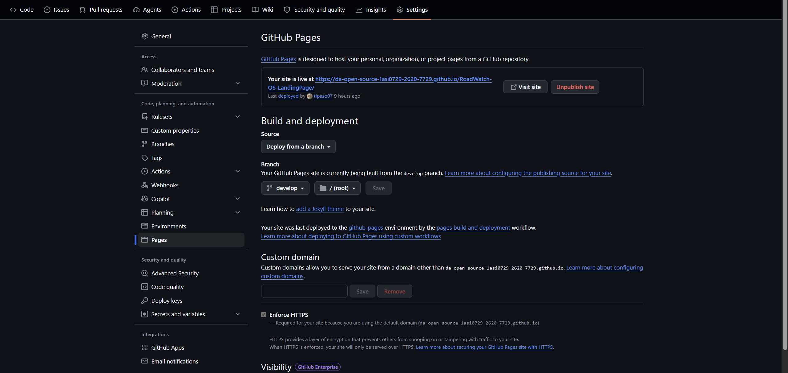
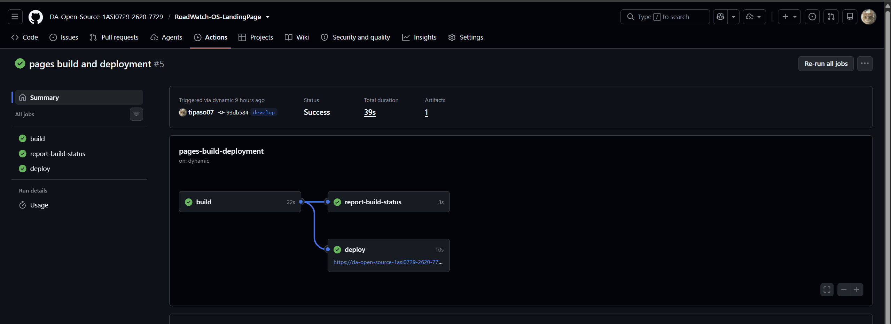
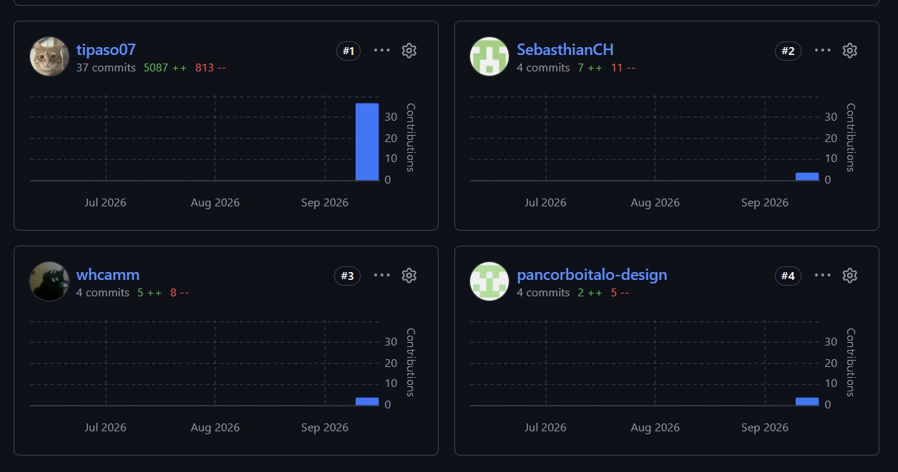
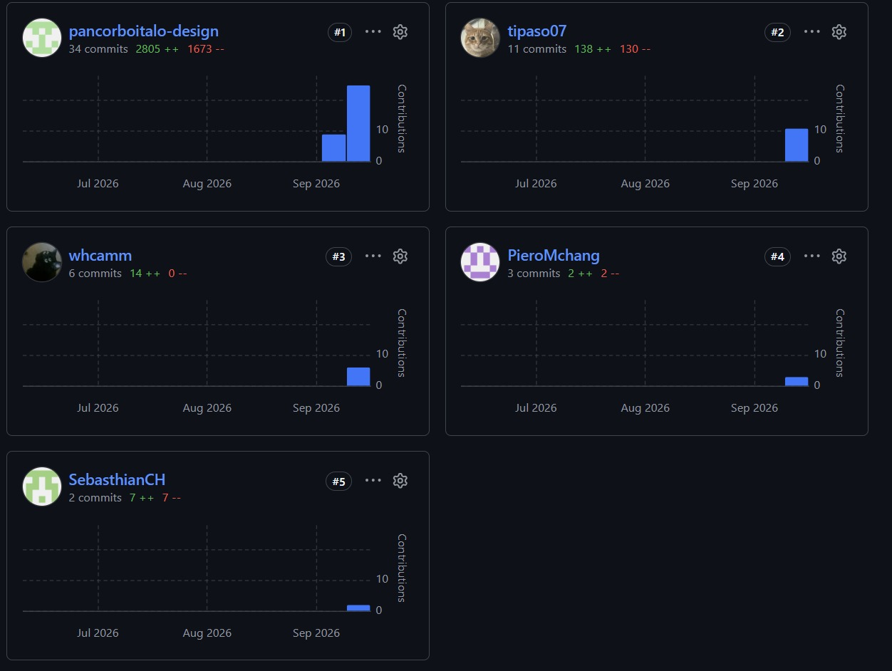

# Capítulo V: Product Implementation, Validation & Deployment

## 5.1. Software Configuration Management

En esta sección se establecen las decisiones y convenciones adoptadas por el equipo de VíaNexo para garantizar la consistencia, trazabilidad y calidad del ciclo de vida del software a lo largo del desarrollo de RoadWatch OS.

---

### 5.1.1. Software Development Environment Configuration

A continuación, se especifican los productos de software utilizados por los miembros del equipo para colaborar en cada etapa del ciclo de vida del producto digital, organizados por tipo de actividad.

#### Project Management

- **Trello** — Herramienta de gestión de tareas y tableros Kanban utilizada para el seguimiento del Sprint Backlog y la coordinación de actividades entre miembros del equipo.  
  Ruta de referencia: https://trello.com

- **Discord / WhatsApp** — Canales de comunicación sincrónica y asincrónica para la coordinación interna del equipo.

#### Requirements Management

- **GitHub (repositorio de informe)** — Plataforma de control de versiones utilizada para la elaboración colaborativa del Project Report en formato Markdown.  
  Ruta de referencia: https://github.com

- **UXPressia** — Herramienta SaaS utilizada para la elaboración de User Personas, Empathy Maps, Journey Maps e Impact Maps.  
  Ruta de referencia: https://uxpressia.com

#### Product UX/UI Design

- **Figma** — Herramienta de diseño colaborativo utilizada para la elaboración de Wireframes, Mock-ups y Prototipos interactivos del Landing Page y la Web Application.  
  Ruta de referencia: https://figma.com

- **FigJam / LucidChart** — Herramientas de diagramación visual utilizadas para la elaboración de Wireflows, User Flows y diagramas de EventStorming.  
  Ruta de referencia: https://figma.com/figjam | https://lucidchart.com

#### Software Development

- **Visual Studio Code** — Editor de código principal utilizado para el desarrollo del Landing Page (HTML5, CSS3 y JavaScript).  
  Ruta de descarga: https://code.visualstudio.com

- **IntelliJ IDEA** — IDE utilizado para el desarrollo del backend con Spring Boot Framework y Java.  
  Ruta de descarga: https://www.jetbrains.com/idea

- **WebStorm** — IDE utilizado para el desarrollo del Frontend Web Application con Angular Framework y TypeScript.  
  Ruta de descarga: https://www.jetbrains.com/webstorm

- **Node.js / npm** — Entorno de ejecución y gestor de paquetes necesario para el desarrollo con Angular.  
  Ruta de descarga: https://nodejs.org

- **Angular CLI** — Interfaz de línea de comandos para la creación y gestión de proyectos Angular.  
  Ruta de referencia: https://angular.io/cli

- **Java JDK 17** — Kit de desarrollo para la implementación del backend con Spring Boot.  
  Ruta de descarga: https://adoptium.net

- **Spring Boot** — Framework Java utilizado para el desarrollo de la RESTful API bajo arquitectura orientada a servicios.  
  Ruta de referencia: https://spring.io/projects/spring-boot

#### Software Deployment

- **GitHub Pages** — Plataforma de hosting estático utilizada para el despliegue del Landing Page.  
  Ruta de referencia: https://pages.github.com

- **Git** — Sistema de control de versiones distribuido utilizado en todos los repositorios del proyecto.  
  Ruta de descarga: https://git-scm.com

#### Software Documentation

- **Swagger / OpenAPI** — Herramienta utilizada para la documentación interactiva de los endpoints del RESTful API.  
  Ruta de referencia: https://swagger.io

- **Structurizr** — Herramienta basada en C4 Model DSL utilizada para la elaboración de diagramas de arquitectura de software.  
  Ruta de referencia: https://structurizr.com

- **ERDPlus / LucidChart** — Herramientas utilizadas para la elaboración de diagramas de base de datos (ERD).  
  Ruta de referencia: https://erdplus.com | https://lucidchart.com

---

### 5.1.2. Source Code Management

El equipo gestiona el código fuente mediante **GitHub** como plataforma de control de versiones, organizado bajo una organización pública que agrupa los repositorios de cada producto digital del proyecto.

**Organización GitHub:**  
https://github.com/DA-Open-Source-1ASI0729-2620-7729

**Repositorios del proyecto:**

| Producto | URL del Repositorio                                                         |
|:---|:----------------------------------------------------------------------------|
<<<<<<< HEAD
| Landing Page | https://github.com/DA-Open-Source-1ASI0729-2620-7729/RoadWatch-LandingPage  |
=======
| Landing Page | https://github.com/DA-Open-Source-1ASI0729-2620-7729/RoadWatch-OS-LandingPage  |
>>>>>>> eb54eb7f9465306acb0c835a4ef2baa5918a446e
| Frontend Web Application |                                                                             |
| Web Services (RESTful API) |                                                                             |
| Project Report | https://github.com/DA-Open-Source-1ASI0729-2620-7729/RoadWatch-OS-Report.git|

#### GitFlow Workflow

El equipo implementa **GitFlow** como estrategia de ramificación para gestionar el ciclo de vida del código. Las ramas definidas son:

- **`main`**: Rama principal que contiene el código de producción estable. Solo recibe merges desde `release` o `hotfix`.
- **`develop`**: Rama de integración continua donde se consolidan los features completados antes de pasar a producción.
- **`feature/<nombre-feature>`**: Rama individual para el desarrollo de cada funcionalidad. Se crea desde `develop` y se integra de vuelta a `develop` al completarse. Ejemplo: `feature/hero-section`, `feature/navbar`, `feature/contact-form`.
- **`release/<versión>`**: Rama de preparación de una nueva versión de producción. Se crea desde `develop` cuando el Sprint está completo. Ejemplo: `release/1.0.0`.
- **`hotfix/<descripción>`**: Rama para correcciones críticas en producción. Se crea desde `main`. Ejemplo: `hotfix/fix-cta-redirect`.

#### Semantic Versioning

Para el nombramiento de versiones se aplica **Semantic Versioning 2.0.0** con el formato `MAJOR.MINOR.PATCH`:
- `MAJOR`: cambios incompatibles con versiones anteriores.
- `MINOR`: nuevas funcionalidades compatibles con versiones anteriores.
- `PATCH`: correcciones de errores compatibles con versiones anteriores.

La primera versión del Landing Page se etiqueta como `v1.0.0`.

#### Conventional Commits

Para los mensajes de commit, el equipo aplica la especificación **Conventional Commits**, usando el formato:

```
<type>(<scope>): <description>
```

Los tipos permitidos son:
- `feat`: nueva funcionalidad.
- `fix`: corrección de error.
- `docs`: cambios en documentación.
- `style`: cambios de formato que no afectan la lógica.
- `refactor`: reestructuración de código sin cambio funcional.
- `chore`: tareas de mantenimiento (dependencias, configuración).
- `test`: adición o modificación de pruebas.

Ejemplos aplicados al proyecto:
```
feat(landing): add hero section with CTA buttons
feat(landing): implement responsive navbar
fix(landing): correct mobile layout for plans section
docs(readme): update deployment instructions
style(landing): apply Material Design color tokens
```

---

### 5.1.3. Source Code Style Guide & Conventions

El equipo adopta las siguientes guías de estilo y convenciones de codificación para garantizar uniformidad y legibilidad en todos los productos. Toda nomenclatura se redacta en **inglés**.

#### HTML5 & CSS3 (Landing Page)
- Se aplica la guía **W3Schools HTML Style Guide** para estructura semántica, indentación con 2 espacios, atributos en minúsculas y uso de comillas dobles.
- Se aplica la guía **Google HTML/CSS Style Guide** para nomenclatura de clases en `kebab-case`, evitar el uso de selectores de ID en CSS y priorizar propiedades abreviadas.
- El diseño visual se basa en **Material Design** como sistema de diseño de referencia.

#### TypeScript & Angular (Frontend Web Application)
- Se aplica la **Angular Coding Style Guide** oficial: componentes con sufijo `Component`, servicios con sufijo `Service`, módulos con sufijo `Module`.
- Nombres de archivos en `kebab-case`: `project-list.component.ts`.
- Se aplica la **Google TypeScript Style Guide** para tipado estricto y gestión de imports.

#### Java & Spring Boot (Web Services)
- Se sigue la convención de **Spring Boot** para controladores (`@RestController`), servicios (`@Service`) y repositorios (`@Repository`).

#### Gherkin (Acceptance Criteria)
- Se aplican las **Gherkin Conventions for Readable Specifications**: un solo nivel de indentación para `Given/When/Then`, escenarios en inglés, descripciones en tercera persona.

---

### 5.1.4. Software Deployment Configuration

En esta sección se describe la configuración de despliegue para el Landing Page, único producto desplegado en el Sprint 1.

#### Landing Page — GitHub Pages

El Landing Page de RoadWatch OS se despliega como sitio web estático mediante **GitHub Pages**, directamente desde el repositorio:  
<<<<<<< HEAD
https://github.com/DA-Open-Source-1ASI0729-2620-7729/RoadWatch-LandingPage
=======
https://github.com/DA-Open-Source-1ASI0729-2620-7729/RoadWatch-OS-LandingPage
>>>>>>> eb54eb7f9465306acb0c835a4ef2baa5918a446e

**Pasos para el despliegue:**

1. Asegurarse de que la rama `main` contiene los archivos del Landing Page (`index.html`, carpetas `css/`, `js/`, `assets/`).
2. Ingresar al repositorio en GitHub y navegar a **Settings > Pages**.
3. En la sección **Source**, seleccionar la rama `main` y la carpeta `/ (root)`.
4. Hacer clic en **Save**. GitHub Pages genera automáticamente la URL de despliegue.
5. Verificar el sitio desplegado en la URL generada por GitHub Pages.

Cualquier push a la rama `main` actualiza automáticamente el sitio desplegado.

---

## 5.2. Landing Page, Services & Applications Implementation

### 5.2.1. Sprint 1

#### 5.2.1.1. Sprint Planning 1

El Sprint 1 tiene como objetivo principal la implementación y despliegue de la primera versión funcional del Landing Page de RoadWatch OS, que permita presentar la propuesta de valor de VíaNexo a los segmentos objetivo (empresas constructoras viales y consultoras supervisoras ambientales) y redirigirlos hacia la futura Web Application.

| Sprint # | Sprint 1                                                                                                                                                                                                                                                                                                                                                                                                                                                                                 |
|:---|:-----------------------------------------------------------------------------------------------------------------------------------------------------------------------------------------------------------------------------------------------------------------------------------------------------------------------------------------------------------------------------------------------------------------------------------------------------------------------------------------|
| **Sprint Planning Background** |                                                                                                                                                                                                                                                                                                                                                                                                                                                                                          |
| Date | 2026-08-25                                                                                                                                                                                                                                                                                                                                                                                                                                                                               |
| Time | 07:00 PM                                                                                                                                                                                                                                                                                                                                                                                                                                                                                 |
| Location | Reunión virtual vía Discord                                                                                                                                                                                                                                                                                                                                                                                                                                                              |
| Prepared By | Pancorbo Amorós, Italo Raul                                                                                                                                                                                                                                                                                                                                                                                                                                                              |
| Attendees | Cabrera Sotelo, Camila Celeste / Conde Huashuayo, Sebasthian Alex / Diaz De La Cruz, Sebastian Gabriel / Montes Chang, Piero Francisco / Pancorbo Amorós, Italo Raul                                                                                                                                                                                                                                                                                                                     |
| Sprint 0 Review Summary | Al ser el primer Sprint del proyecto, no existe un Sprint anterior. Se parte del Product Backlog inicial definido y de los artefactos elaborados en los capítulos previos.                                                                                                                                                                                                                                                                                                               |
| Sprint 0 Retrospective Summary | El equipo acordó establecer estándares de trabajo desde el inicio: aplicar GitFlow, Conventional Commits y dividir las responsabilidades de implementación del Landing Page por secciones entre los miembros.                                                                                                                                                                                                                                                                            |
| **Sprint Goal & User Stories** |                                                                                                                                                                                                                                                                                                                                                                                                                                                                                          |
| Sprint 1 Goal | Our focus is on delivering a fully deployed and navigable Landing Page for RoadWatch OS. We believe it delivers a clear understanding of the value proposition to potential clients from both target segments (construction companies and environmental supervisors). This will be confirmed when visitors can navigate all sections of the Landing Page, identify the product's features, compare subscription plans, and access the call-to-action buttons for each segment.           |
| Sprint 1 Velocity | 20 Story Points                                                                                                                                                                                                                                                                                                                                                                                                                                                                          |
| Sum of Story Points | 19 Story Points                                                                                                                                                                                                                                                                                                                                                                                                                                                                          |

---

#### 5.2.1.2. Aspect Leaders and Collaborators

Para el Sprint 1, los aspectos de trabajo se organizan en torno a las secciones del Landing Page y la configuración del entorno de desarrollo y despliegue. Cada aspecto cuenta con un líder responsable de liderar la implementación y uno o más colaboradores de apoyo.

| Team Member | GitHub Username            | Hero & Navbar | Plans Section | Features Section | Contact Form | Deployment & Config |
|:---|:---------------------------|:---:|:---:|:---:|:---:|:---:|
| Cabrera Sotelo, Camila Celeste | *whcamm*               | L | C | | | C |
| Conde Huashuayo, Sebasthian Alex | *SebasthianCH*             | C | | L | C | C |
| Diaz De La Cruz, Sebastian Gabriel | *tipaso07*               | C | | C | L | |
| Montes Chang, Piero Francisco | *chang*               | | L | C | | C |
| Pancorbo Amorós, Italo Raul | *pancorboitalo-design*               | | C | C | | L |

*L = Líder | C = Colaborador*

---

#### 5.2.1.3. Sprint Backlog 1

El objetivo principal de este Sprint es implementar y desplegar la primera versión del Landing Page de RoadWatch OS, cubriendo las secciones de presentación de valor, funcionalidades, planes de suscripción, testimonios y formulario de contacto, con CTAs diferenciados para cada segmento objetivo.

A continuación, se presenta el tablero de control del Sprint 1. El Sprint # es el 1, con un velocity acordado de 20 Story Points y un total comprometido de 19 Story Points.

> **URL del Board en Trello:** https://trello.com/invite/b/6aaaf893146da1803fa7c582/ATTI953be54ae0a00d9a1f783b712cdcda28CEA7DD62/roadwatch-os-sprint-1

**

| **Story Id** | **Story Title** | **Task Id**| **Task Title** | **Task Description** | **Estimation (Hours)** | **Assigned To** | **Status** |
|:---|:---|:---|:---|:---|:---|:---|:---|
| US02 | Demo de Tablero Geolocalizado | T01 | Sección "Funciones" con mapa demo | Implementar la sección de funcionalidades del Landing Page mostrando un mapa estático o animación del tablero de monitoreo como demo visual. | 4 | Conde Huashuayo, Sebasthian | Done |
| US03 | Explicación de planes | T02 | Sección "Planes" con tabla comparativa | Desarrollar la sección de planes con tabla de comparación Base / Profesional / Enterprise y sus características. | 4 | Montes Chang, Piero | Done |
| US04 | CTA Segmento Consultora | T03 | Botón CTA "Monitorea tu proyecto" | Implementar el call-to-action para el segmento de consultoras supervisoras, con redirección a la vista de registro/login de la Web App. | 2 | Diaz De La Cruz, Sebastian | Done |
| US05 | CTA Segmento Empresa Multi-Proyecto | T04 | Botón CTA "Gestiona tu cartera" | Implementar el call-to-action para el segmento de empresas constructoras multi-proyecto, con redirección al dashboard. | 2 | Diaz De La Cruz, Sebastian | Done |
| US06 | Caso de Uso / Testimonio | T05 | Sección de métricas e impacto | Implementar sección con cifras de impacto ilustrativas (ej. reducción de tiempo de respuesta, proyectos integrados). | 3 | Conde Huashuayo, Sebasthian | Done |
| US08 | Formulario de Contacto Comercial | T06 | Formulario de contacto con validación | Desarrollar el formulario de captura de leads con validación de campos y mensaje de confirmación al enviar. | 4 | Diaz De La Cruz, Sebastian | Done |
| — | Configuración general | T07 | Navbar y estructura base del Landing Page | Implementar el navbar responsivo con logo, secciones y links de navegación internos. Configurar la estructura HTML base del proyecto. | 3 | Cabrera Sotelo, Camila | Done |
| — | Configuración general | T08 | Hero Section con propuesta de valor | Diseñar e implementar la sección hero con headline, subtítulo, imagen de fondo y CTAs principales. | 3 | Cabrera Sotelo, Camila | Done |
| — | Despliegue | T09 | Configuración y despliegue en GitHub Pages | Configurar el repositorio para despliegue automático vía GitHub Pages desde la rama main. Verificar el correcto funcionamiento del sitio desplegado. | 2 | Pancorbo Amorós, Italo | Done |

---

#### 5.2.1.4. Development Evidence for Sprint Review

Durante el Sprint 1 se implementó la primera versión del Landing Page de RoadWatch OS. Los commits realizados en el repositorio evidencian el avance progresivo por secciones, con la participación de todos los miembros del equipo.

| Repository | Branch | Commit Id | Commit Message | Commit Message Body | Commited on (Date) |
|:---|:---|:---|:---|:---|:---|
| DA-Open-Source-1ASI0729-2620-7729/RoadWatch-OS-LandingPage | main | *(hash)* | chore: initialize landing page project structure | Set up base HTML, CSS and JS folder structure with initial index.html | 2026-08-26 |
| DA-Open-Source-1ASI0729-2620-7729/RoadWatch-OS-LandingPage | feature/navbar | *(hash)* | feat(landing): add responsive navbar with internal links | Implement sticky navbar with logo, nav links and mobile hamburger menu | 2026-08-27 |
| DA-Open-Source-1ASI0729-2620-7729/RoadWatch-OS-LandingPage | feature/hero-section | *(hash)* | feat(landing): add hero section with headline and CTA | Hero section with value proposition copy, background image and primary CTA buttons | 2026-08-27 |
| DA-Open-Source-1ASI0729-2620-7729/RoadWatch-OS-LandingPage | feature/features-section | *(hash)* | feat(landing): implement features section with map demo | Add features section with icon cards and static map visualization | 2026-08-28 |
| DA-Open-Source-1ASI0729-2620-7729/RoadWatch-OS-LandingPage | feature/plans-section | *(hash)* | feat(landing): add subscription plans comparison table | Implement Base, Professional and Enterprise plan cards with feature list | 2026-08-29 |
| DA-Open-Source-1ASI0729-2620-7729/RoadWatch-OS-LandingPage | feature/cta-segments | *(hash)* | feat(landing): add segment-specific CTA buttons | Add CTAs for constructora and supervisora segments with redirect links | 2026-08-29 |
| DA-Open-Source-1ASI0729-2620-7729/RoadWatch-OS-LandingPage | feature/testimonials | *(hash)* | feat(landing): implement impact metrics and testimonials section | Add section with key performance metrics and illustrative testimonials | 2026-08-30 |
| DA-Open-Source-1ASI0729-2620-7729/RoadWatch-OS-LandingPage | feature/contact-form | *(hash)* | feat(landing): add contact form with field validation | Implement lead capture form with client-side validation and confirmation message | 2026-08-31 |
| DA-Open-Source-1ASI0729-2620-7729/RoadWatch-OS-LandingPage | main | *(hash)* | chore: configure GitHub Pages deployment | Enable GitHub Pages from main branch, verify production URL | 2026-09-01 |
| DA-Open-Source-1ASI0729-2620-7729/RoadWatch-OS-LandingPage | main | *(hash)* | fix(landing): fix mobile responsiveness on plans section | Adjust grid layout breakpoints for correct display on mobile devices | 2026-09-02 |

---

#### 5.2.1.5. Execution Evidence for Sprint Review

Al finalizar el Sprint 1, se logró desplegar la primera versión funcional del Landing Page de RoadWatch OS en GitHub Pages. El sitio presenta todas las secciones planificadas en el Sprint Backlog: navbar responsivo, hero section con propuesta de valor, sección de funcionalidades con demo visual del tablero de monitoreo, sección de planes de suscripción con tabla comparativa, sección de métricas de impacto, CTAs diferenciados para cada segmento objetivo y formulario de contacto comercial con validación.

La experiencia es consistente entre el segmento de empresas constructoras y supervisoras ambientales, y los call-to-action de cada segmento redirigen al usuario a la vista correspondiente en la Web Application (actualmente apuntando a la URL de la futura aplicación).

**Video de navegación del Landing Page (Sprint 1):**  
URL: *https://upcedupe-my.sharepoint.com/:v:/g/personal/u202410421_upc_edu_pe/IQC42lSycdIVS4-Oi0OhpG9EATYxm0X6Y7foFXAAdKn9XwU?nav=eyJyZWZlcnJhbEluZm8iOnsicmVmZXJyYWxBcHAiOiJTdHJlYW1XZWJBcHAiLCJyZWZlcnJhbFZpZXciOiJTaGFyZURpYWxvZy1MaW5rIiwicmVmZXJyYWxBcHBQbGF0Zm9ybSI6IldlYiIsInJlZmVycmFsTW9kZSI6InZpZXcifX0%3D&e=RUyDKY*  

---

#### 5.2.1.6. Services Documentation Evidence for Sprint Review

Durante el Sprint 1, el alcance de implementación se centró exclusivamente en el Landing Page estático. No se implementaron endpoints de Web Services en este Sprint, por lo que no aplica documentación de API para esta entrega.

Como preparación para los Sprints siguientes, el equipo definió la estructura base de los endpoints que serán documentados con OpenAPI/Swagger a partir del Sprint 3, en concordancia con los Technical Stories del Product Backlog (US24 al US39).

| Endpoint | Acción | Estado |
|:---|:---|:---|
| `POST /api/v1/auth/login` | Autenticación JWT | Pendiente (Sprint 3) |
| `GET /api/v1/projects` | Listado de proyectos viales | Pendiente (Sprint 3) |
| `POST /api/v1/indicators` | Registro de indicador ambiental | Pendiente (Sprint 3) |
| `GET /api/v1/reports/{projectId}` | Generación de reporte de auditoría | Pendiente (Sprint 3) |

---

#### 5.2.1.7. Software Deployment Evidence for Sprint Review

Durante el Sprint 1 se realizó el despliegue del Landing Page de RoadWatch OS en **GitHub Pages**. A continuación, se describen los pasos realizados:

1. **Creación del repositorio:** Se creó el repositorio público `RoadWatch-OS-LandingPage` bajo la organización `DA-Open-Source-1ASI0729-2620-7729` en GitHub.

2. **Inicialización del proyecto:** Se inicializó el repositorio con la estructura de carpetas base (`index.html`, `css/`, `js/`, `assets/`) y se realizó el primer commit desde la rama `main`.

3. **Configuración de GitHub Pages:** Desde la pestaña **Settings > Pages** del repositorio, se seleccionó la rama `main` como fuente de despliegue con la carpeta raíz `/`.

4. **Verificación del despliegue:** GitHub Pages generó automáticamente la URL de producción del sitio. Se verificó el correcto renderizado de todas las secciones y la responsividad en dispositivos móviles.

5. **Automatización de actualizaciones:** Cada push a la rama `main` actualiza automáticamente el sitio sin configuración adicional.




URL del Landing Page desplegado:  
https://da-open-source-1asi0729-2620-7729.github.io/RoadWatch-OS-LandingPage/

---

#### 5.2.1.8. Team Collaboration Insights during Sprint

Durante el Sprint 1, todos los miembros del equipo participaron activamente en la implementación del Landing Page, asumiendo responsabilidades sobre secciones específicas según la matriz de líderes y colaboradores definida en la sección 5.2.1.2.

La estrategia de colaboración adoptada fue la siguiente: cada miembro trabajó sobre su rama `feature/<sección>` correspondiente, realizando commits frecuentes con mensajes bajo la convención de Conventional Commits. Una vez completada cada sección, se realizó un Pull Request hacia la rama `develop` para revisión del líder del aspecto correspondiente. Tras la revisión, se realizó el merge y, al concluir el Sprint, se integró `develop` en `main` para el despliegue final.

A continuación, se presentan los analíticos de colaboración del repositorio del Landing Page:



**Figura X. Resultados e insights de la Landing Page.**



**Figura X. Resultados e insights del reporte.**

| Miembro del equipo | Contribuciones principales en el Sprint |
|:---|:---|
| Cabrera Sotelo, Camila Celeste | Implementación de Navbar y Hero Section; revisión general de responsividad. |
| Conde Huashuayo, Sebasthian Alex | Sección de Funcionalidades con demo visual del tablero de monitoreo; sección de testimonios y métricas de impacto. |
| Diaz De La Cruz, Sebastian Gabriel | CTAs diferenciados para segmentos constructora y supervisora; formulario de contacto con validación. |
| Montes Chang, Piero Francisco | Sección de Planes con tabla comparativa de suscripciones. |
| Pancorbo Amorós, Italo Raul | Configuración del entorno de despliegue en GitHub Pages; gestión de ramas y merge final a `main`. |

#### 5.2.2.2. Aspect Leaders and Collaborators

Para el Sprint 2, el trabajo se ha paralelizado enfocándose en los Bounded Contexts principales de la plataforma. Cada miembro del equipo asume el rol de líder (L) en el dominio que le fue asignado, colaborando (C) en las integraciones transversales.

| Team Member | GitHub Username | Identity & Access | Project Mgmt | Env. Monitoring | Incident Mgmt | Document Mgmt |
|:---|:---|:---:|:---:|:---:|:---:|:---:|
| Cabrera Sotelo, Camila Celeste | *whcamm* | | | | C | L |
| Conde Huashuayo, Sebasthian Alex | *SebasthianCH* | C | L | | | |
| Diaz De La Cruz, Sebastian Gabriel| *tipaso07* | L | | C | | |
| Montes Chang, Piero Francisco | *chang* | | C | L | | |
| Pancorbo Amorós, Italo Raul | *pancorboitalo-design* | | | | L | C |

*L = Líder | C = Colaborador*

---

#### 5.2.2.3. Sprint Backlog 2

El objetivo de este Sprint es establecer la base de las aplicaciones funcionales para los distintos dominios del sistema, asegurando que tanto las empresas constructoras como las supervisoras puedan empezar a interactuar con sus respectivos módulos.

| **Story Id** | **Story Title** | **Task Id**| **Task Title** | **Task Description** | **Estimation (Hours)** | **Assigned To** | **Status** |
|:---|:---|:---|:---|:---|:---|:---|:---|
| US09 | Autenticación y Accesos | T01 | Login y gestión de usuarios | Implementar autenticación JWT, definición de roles, permisos y configuración de planes de suscripción. | 5 | Diaz De La Cruz, Sebastian | Done |
| US10 | Gestión de Portafolio | T02 | CRUD de Proyectos viales | Desarrollar la gestión de proyectos, asignación de responsables y visualización de puntos de monitoreo. | 5 | Conde Huashuayo, Sebasthian | Done |
| US11 | Monitoreo Operativo | T03 | Dashboard Ambiental | Construir el dashboard de mediciones, registro de indicadores, validación de umbrales y alertas. | 5 | Montes Chang, Piero | Done |
| US12 | Control de Incidencias | T04 | Kanban de Mitigación | Implementar tablero Kanban de incidencias, actualización de estados, comentarios y seguimiento de acciones. | 5 | Pancorbo Amorós, Italo | Done |
| US13 | Gestión Documental | T05 | Repositorio de Evidencias | Desarrollar módulo para carga de documentos normativos, reportes de auditoría, evidencias y exportación PDF. | 5 | Cabrera Sotelo, Camila | Done |
| — | Integración Global | T06 | Enrutamiento e Interfaz Base | Configurar layout principal de la Web App conectando los 5 Bounded Contexts desarrollados por el equipo. | 4 | Pancorbo Amorós, Italo | Done |

---

#### 5.2.2.4. Development Evidence for Sprint Review

Durante el Sprint 2, el equipo trabajó sobre el repositorio de la Web Application (Frontend) y el inicio de los Web Services (Backend). Los commits evidencian el avance modular basado en la distribución de dominios.

| Repository | Branch | Commit Id | Commit Message | Commit Message Body | Commited on (Date) |
|:---|:---|:---|:---|:---|:---|
| DA-Open-Source/RoadWatch-OS-Frontend | feature/identity-access | *(hash)* | feat(auth): implement login and jwt handling | Added authentication service and role-based access control for subscription plans. | 2026-09-12 |
| DA-Open-Source/RoadWatch-OS-Frontend | feature/project-mgmt | *(hash)* | feat(projects): add project portfolio view | Created project list, detail views, and monitoring point mapping. | 2026-09-14 |
| DA-Open-Source/RoadWatch-OS-Frontend | feature/env-monitoring | *(hash)* | feat(monitoring): build environmental dashboard | Implemented real-time measurement charts and threshold alert indicators. | 2026-09-16 |
| DA-Open-Source/RoadWatch-OS-Frontend | feature/incident-mgmt | *(hash)* | feat(incidents): implement kanban board drag-drop | Added interactive Kanban for incident status, mitigation tracking and responsibles. | 2026-09-18 |
| DA-Open-Source/RoadWatch-OS-Frontend | feature/document-mgmt | *(hash)* | feat(documents): add evidence upload and pdf export | Integrated file upload component for compliance reports and audit evidence. | 2026-09-20 |
| DA-Open-Source/RoadWatch-OS-Frontend | main | *(hash)* | chore(core): merge bounded contexts into main layout | Integrated all 5 feature branches into the master routing layout. | 2026-09-21 |

---

#### 5.2.2.5. Execution Evidence for Sprint Review

Al finalizar el Sprint 2, la Web Application cuenta con la estructura fundamental de los 5 dominios operativos. Los usuarios pueden iniciar sesión según su rol (Constructor o Supervisor), visualizar sus proyectos asignados, consultar las métricas ambientales, gestionar el estado de las incidencias mediante un tablero Kanban interactivo y adjuntar la documentación de cumplimiento correspondiente.

**Video de navegación de la Web Application (Sprint 2):**  
*(Enlace al video de demostración técnica del funcionamiento integrado de los módulos)*

---

#### 5.2.2.6. Services Documentation Evidence for Sprint Review

En paralelo al frontend, se definieron los contratos de la API RESTful (Swagger/OpenAPI) correspondientes a cada Bounded Context para asegurar la correcta comunicación cliente-servidor:

| Bounded Context | Endpoint Principal | Estado |
|:---|:---|:---|
| Identity & Access | `POST /api/v1/auth/login` | Implementado |
| Project Management | `GET /api/v1/projects` | Implementado |
| Environmental Monitoring | `POST /api/v1/measurements` | Implementado |
| Incident Management | `PATCH /api/v1/incidents/{id}/status` | Implementado |
| Document Management | `POST /api/v1/documents/upload` | Implementado |

---

#### 5.2.2.7. Software Deployment Evidence for Sprint Review

La Web Application fue integrada y desplegada en un entorno de pruebas continuas (QA).
1. **Configuración CI/CD:** Se automatizó el proceso de build tras cada *merge* a la rama `main`.
2. **Despliegue del Frontend:** Se alojaron los artefactos estáticos de Angular asegurando el ruteo dinámico de las SPA.
3. **Despliegue de Servicios:** Se levantó una instancia inicial del Backend principal para resolver las peticiones de autenticación y carga de datos base.

URL de la Web Application desplegada (QA):  
*(Enlace al entorno de QA de VíaNexo / RoadWatch OS)*

---

#### 5.2.2.8. Team Collaboration Insights during Sprint

La estrategia colaborativa de este Sprint consistió en la separación de responsabilidades ("Divide y Vencerás"). Cada integrante clonó la estructura base y trabajó exclusivamente dentro de la carpeta y módulo de su Bounded Context, reduciendo drásticamente los conflictos de fusión (Merge Conflicts) al final del ciclo.

| Miembro del equipo | Contribuciones principales en el Sprint |
|:---|:---|
| Cabrera Sotelo, Camila Celeste | Lideró el módulo de gestión documental, asegurando la subida de archivos, versionado de evidencias y preparación para exportación de KPIs. |
| Conde Huashuayo, Sebasthian Alex | Estructuró el portafolio de proyectos, permitiendo la asignación de responsables y la visualización de los puntos de monitoreo viales. |
| Diaz De La Cruz, Sebastian Gabriel | Implementó el sistema base de autenticación (Login), perfiles de usuario y las validaciones de acceso según la suscripción de la empresa. |
| Montes Chang, Piero Francisco | Construyó el centro de alertas e historial de mediciones, enfocándose en la validación de valores frente a umbrales permitidos. |
| Pancorbo Amorós, Italo Raul | Desarrolló la vista interactiva de incidencias críticas (Kanban y detalle), permitiendo el seguimiento de las acciones de mitigación de inicio a fin. |
